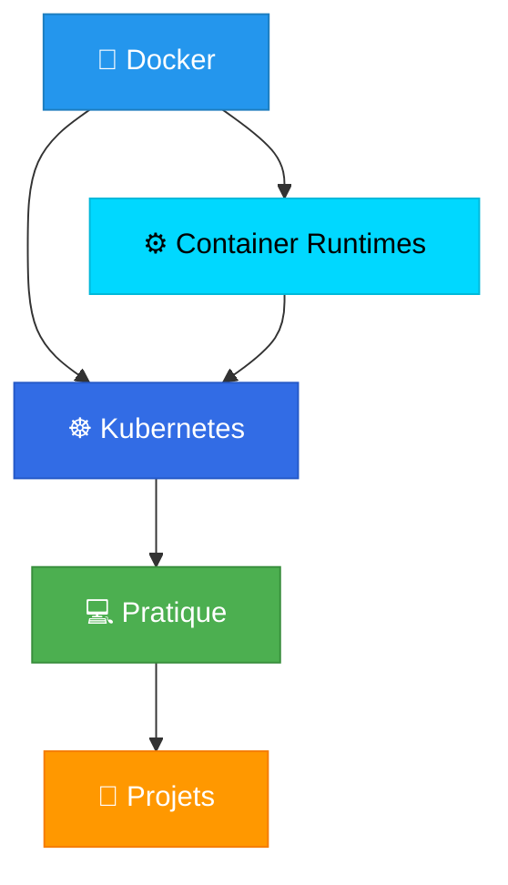

# 🎓 Bienvenue dans la Documentation Kubernetes & Docker

> Guide complet d'apprentissage des conteneurs et de l'orchestration

## 🗺️ Parcours d'apprentissage



## 📚 Chapitres principaux

### [[01-Docker/00-INDEX|🐳 01 - Docker]]
**Fondamentaux de la conteneurisation**
- Comprendre les conteneurs
- Créer et gérer des images
- Orchestrer avec Docker Compose
- Réseau et stockage persistant

### [[02-Kubernetes/00-INDEX|☸️ 02 - Kubernetes]]
**Orchestration de conteneurs à grande échelle**
- Architecture Kubernetes
- Déploiement d'applications
- Services et réseau
- Scalabilité et haute disponibilité

### [[03-Container-Runtimes/00-INDEX|⚙️ 03 - Container Runtimes]]
**Comprendre l'écosystème sous-jacent**
- containerd, CRI-O, runc
- Interface CRI (Container Runtime Interface)
- Architecture complète des runtimes

### [[04-Pratique/00-INDEX|💻 04 - Pratique]]
**Exercices hands-on et labs**

### [[05-Projets/00-INDEX|🚀 05 - Projets]]
**Applications réelles et cas d'usage**

### [[06-YAML-Examples/00-INDEX|📝 06 - YAML Examples]]
**Bibliothèque de manifests**

## 🎯 Comment utiliser cette documentation ?

### Pour les débutants
1. Commencez par [[01-Docker/01-Introduction/01-Qu-est-ce-que-Docker|Docker - Introduction]]
2. Suivez le parcours dans l'ordre
3. Pratiquez avec les exercices du chapitre [[04-Pratique/00-INDEX|Pratique]]

### Pour les utilisateurs intermédiaires
1. Révisez Docker si nécessaire
2. Plongez directement dans [[02-Kubernetes/00-INDEX|Kubernetes]]
3. Explorez [[03-Container-Runtimes/00-INDEX|Container Runtimes]] pour approfondir

### Pour les experts
- Utilisez cette doc comme référence
- Consultez [[06-YAML-Examples/00-INDEX|YAML Examples]] pour des templates
- Contribuez à [[05-Projets/00-INDEX|Projets]] avec vos cas d'usage

## 🔧 Outils et prérequis

### Installation requise
- Docker Desktop / Docker Engine
- kubectl (client Kubernetes)
- Minikube ou Kind (pour environnement local)

### Outils recommandés
- Obsidian (pour visualiser cette documentation)
- VS Code avec extensions Docker et Kubernetes
- Terminal avec autocomplétion bash/zsh

## 📖 Ressources externes

- [KodeKloud - Cours Docker](https://kodekloud.com/courses/docker-for-the-absolute-beginner/)
- [KodeKloud - Cours Kubernetes](https://kodekloud.com/courses/kubernetes-for-the-absolute-beginners/)
- [Documentation officielle Docker](https://docs.docker.com/)
- [Documentation officielle Kubernetes](https://kubernetes.io/docs/)

## 🤓 Progression

Créez votre propre suivi de progression en créant une note personnelle !

```markdown
## Ma progression
- [ ] Docker - Introduction
- [ ] Docker - Commandes
- [ ] Docker - Images
- [ ] Kubernetes - Concepts
- [ ] ...
```

---

**Prêt à commencer ? Direction [[01-Docker/00-INDEX|Docker]] ! 🚀**
