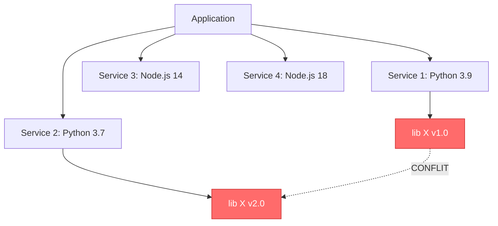

# 🤔 Pourquoi Docker ?

## Le problème avant Docker

### "Ça marche sur ma machine !" 🤷

C'est LA phrase classique que tout développeur a déjà entendue ou prononcée :

```
👨‍💻 Développeur : "Le code fonctionne parfaitement sur mon laptop !"
🔧 Ops : "Mais ça plante en test..."
🔧 Ops : "Et ça ne marche pas du tout en production..."
```

### Causes courantes des problèmes

| Problème | Exemple |
|----------|---------|
| **Versions différentes** | Dev a Python 3.9, Prod a Python 3.7 |
| **Dépendances manquantes** | Bibliothèque installée en dev, absente en prod |
| **Configuration système** | Variables d'environnement différentes |
| **OS différent** | Développement sur Mac, production sur Linux |
| **Conflits de ports** | Port 8080 déjà utilisé par un autre service |

## La "Matrix from Hell" 🔥

Imaginez une équipe travaillant sur une application moderne :

```
Application =
  + Frontend (React 18)
  + Backend API (Node.js 16 + Express)
  + Worker (Python 3.10 + Celery)
  + Base de données (PostgreSQL 14)
  + Cache (Redis 7)
  + Message Queue (RabbitMQ)
```

### Le cauchemar de compatibilité

Chaque service a ses propres dépendances, et celles-ci peuvent **entrer en conflit** :



### Problèmes concrets

1. **Installation laborieuse pour les nouveaux**
   ```bash
   # Guide d'installation de 50 étapes
   # "Ça prend 2 jours pour setup l'environnement"
   ```

2. **Environnements impossibles à maintenir**
   - Dev, Test, Staging, Production : tous différents
   - Personne n'ose mettre à jour de peur de tout casser

3. **Déploiement risqué**
   - "On espère que ça va marcher en prod..."
   - Rollback compliqué en cas de problème

## La solution : Docker 🐳

### Conteneurs à la rescousse

Docker résout tous ces problèmes en **empaquetant l'application avec toutes ses dépendances** dans un **conteneur isolé**.

```
┌─────────────────────────────────┐
│     Conteneur Docker            │
│                                 │
│  ┌─────────────────────────┐   │
│  │   Application           │   │
│  │   + Code                │   │
│  │   + Dépendances         │   │
│  │   + Config              │   │
│  │   + Runtime             │   │
│  └─────────────────────────┘   │
│                                 │
└─────────────────────────────────┘
```

### Avant vs Après Docker

#### ❌ Sans Docker
```bash
# Sur la machine du dev
git clone app
cd app
npm install  # Espoir que ça marche...
# Oh non, version de Node incompatible
nvm install 16
npm install  # Nouvel espoir...
# Oh non, dépendance système manquante
sudo apt-get install libpq-dev
npm install  # 3ème tentative...
# Enfin ça marche ! (2h plus tard)
```

#### ✅ Avec Docker
```bash
docker run mon-app
# Ça fonctionne. Point final.
```

## Les avantages de Docker

### 1. 📦 Portabilité totale

```
Laptop du dev (Mac)
    ↓
  Docker Image
    ↓
Serveur de test (Linux)
    ↓
  MÊME Docker Image
    ↓
Production (Cloud)
```

**Le conteneur fonctionne identiquement partout.**

### 2. ⚡ Légèreté et rapidité

| Action | Machine Virtuelle | Docker |
|--------|-------------------|--------|
| **Taille** | 5-10 GB | 50-500 MB |
| **Démarrage** | 1-2 minutes | 2-5 secondes |
| **Utilisation RAM** | 2-4 GB | 50-200 MB |

### 3. 🔧 Isolation des environnements

```bash
# Lancer 3 versions différentes de PostgreSQL
docker run -d postgres:12
docker run -d postgres:13
docker run -d postgres:14

# Aucun conflit ! Chacun dans son conteneur isolé
```

### 4. 🚀 Onboarding ultra-rapide

**Avant Docker :**
```
Nouveau développeur arrive
→ 2 jours pour installer l'environnement
→ 1 jour de debug "pourquoi ça marche pas chez moi"
```

**Avec Docker :**
```bash
git clone projet
docker-compose up
# C'est prêt en 5 minutes
```

### 5. 📈 Scalabilité facile

Besoin de plus de puissance ? Lancez plus de conteneurs !

```bash
# 1 instance
docker run -d mon-api

# Besoin de plus ? Lancez-en 10 !
for i in {1..10}; do
  docker run -d mon-api
done
```

### 6. 🔄 DevOps simplifié

Le développeur crée un **Dockerfile** qui décrit exactement l'environnement :

```dockerfile
FROM node:18
WORKDIR /app
COPY package*.json ./
RUN npm install
COPY . .
CMD ["npm", "start"]
```

L'équipe Ops **utilise exactement la même recette** pour déployer en production.

**Plus de "ça marche pas chez moi" !**

## Cas d'usage concrets

### 1. Développement local

```bash
# Besoin d'une base MySQL pour développer ?
docker run -d -p 3306:3306 -e MYSQL_ROOT_PASSWORD=secret mysql:8

# Plus besoin d'installer MySQL sur votre machine !
```

### 2. Tests automatisés (CI/CD)

```yaml
# Fichier .gitlab-ci.yml
test:
  image: node:18
  script:
    - npm install
    - npm test
```

Chaque pipeline de tests s'exécute dans un environnement propre et identique.

### 3. Microservices

```
Application E-commerce
├── Frontend (React) → Conteneur 1
├── API Users (Node.js) → Conteneur 2
├── API Products (Python) → Conteneur 3
├── API Orders (Go) → Conteneur 4
├── Base de données (PostgreSQL) → Conteneur 5
└── Cache (Redis) → Conteneur 6
```

Chaque service vit dans son propre conteneur, **indépendant et isolé**.

### 4. Déploiement multi-environnements

```bash
# Même image, différents environnements
docker run -e ENV=dev mon-app      # Développement
docker run -e ENV=test mon-app     # Tests
docker run -e ENV=prod mon-app     # Production
```

## Résumé : Pourquoi Docker ?

| Problème | Solution Docker |
|----------|-----------------|
| 😫 "Ça marche sur ma machine" | ✅ Ça marche partout de la même façon |
| 😫 Installation compliquée | ✅ `docker run` et c'est tout |
| 😫 Conflits de dépendances | ✅ Chaque conteneur est isolé |
| 😫 Environnements différents | ✅ Même image = même environnement |
| 😫 Déploiement risqué | ✅ Testé en dev = fonctionne en prod |
| 😫 Scalabilité difficile | ✅ Lancez plus de conteneurs |

## Ce que Docker n'est PAS

❌ Docker n'est **pas** une machine virtuelle
❌ Docker ne remplace **pas** Kubernetes (il le complète)
❌ Docker n'est **pas** la solution à tous les problèmes
❌ Docker ne résout **pas** les bugs dans votre code 😉

## Prochaine étape

Maintenant que vous comprenez **pourquoi** Docker existe, voyons **comment** il fonctionne par rapport aux machines virtuelles.

---

→ [[02-Conteneurs-vs-VMs|Conteneurs vs Machines Virtuelles]]
← [[00-INDEX|Retour à l'index]]
