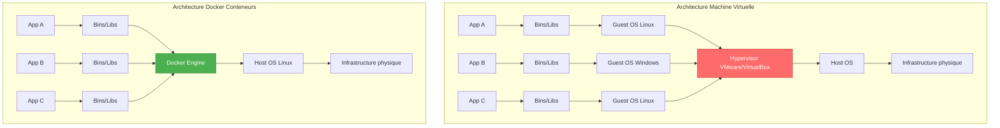

# ⚖️ Conteneurs vs Machines Virtuelles

## Comparaison visuelle



## Différences fondamentales

### Architecture

| Composant | Machine Virtuelle | Conteneur Docker |
|-----------|-------------------|------------------|
| **OS complet** | ✅ Oui (Guest OS pour chaque VM) | ❌ Non (partage le kernel de l'hôte) |
| **Hypervisor** | ✅ VMware, VirtualBox, Hyper-V | ❌ Pas nécessaire |
| **Kernel** | Un par VM | Partagé entre tous les conteneurs |
| **Isolation** | Complète (hardware virtualisé) | Processus (namespaces, cgroups) |

### Performance

| Aspect | Machine Virtuelle | Conteneur Docker |
|--------|-------------------|------------------|
| **Taille** | 5-20 GB par VM | 50-500 MB par conteneur |
| **Temps de démarrage** | 1-2 minutes | 2-5 secondes |
| **Utilisation CPU** | Overhead 10-20% | Proche du natif (~2%) |
| **Utilisation RAM** | 2-8 GB minimum par VM | 10-200 MB par conteneur |
| **Densité** | 5-10 VMs par serveur | 100-1000 conteneurs par serveur |

### Consommation de ressources - Exemple concret

**Scénario** : Héberger 10 applications sur un serveur de 64GB RAM

#### Avec VMs
```
10 VMs × 4 GB RAM chacune = 40 GB
+ Hypervisor : 4 GB
= 44 GB utilisés
→ 20 GB restants
→ Impossible d'ajouter plus de VMs
```

#### Avec Docker
```
10 conteneurs × 200 MB RAM chacun = 2 GB
+ Docker Engine : 500 MB
= 2.5 GB utilisés
→ 61.5 GB restants
→ Possibilité d'ajouter 300+ conteneurs !
```

## Détails techniques

### Machine Virtuelle

```
┌─────────────────────────────────────┐
│        Application                  │
├─────────────────────────────────────┤
│        Binaires & Librairies        │
├─────────────────────────────────────┤
│    Guest OS (Ubuntu, Windows...)    │  ← OS COMPLET
│    • Kernel propre                  │
│    • Drivers                        │
│    • Services système               │
│    Taille : 2-10 GB                 │
├─────────────────────────────────────┤
│        Hypervisor                   │
│    (VMware, VirtualBox, KVM)        │
├─────────────────────────────────────┤
│        Host OS                      │
├─────────────────────────────────────┤
│    Infrastructure matérielle        │
└─────────────────────────────────────┘
```

**Avantages :**
- ✅ Isolation maximale
- ✅ Peut exécuter des OS différents (Linux, Windows, BSD)
- ✅ Sécurité renforcée

**Inconvénients :**
- ❌ Lourd (Go par VM)
- ❌ Lent à démarrer
- ❌ Consommation élevée de ressources
- ❌ Overhead performance

### Conteneur Docker

```
┌─────────────────────────────────────┐
│        Application                  │
├─────────────────────────────────────┤
│    Binaires & Librairies            │
│    Taille : 50-500 MB               │
├═════════════════════════════════════┤
│        Docker Engine                │  ← Couche légère
├═════════════════════════════════════┤
│        Host OS (Linux Kernel)       │  ← Kernel PARTAGÉ
├─────────────────────────────────────┤
│    Infrastructure matérielle        │
└─────────────────────────────────────┘
```

**Avantages :**
- ✅ Ultraléger (MB par conteneur)
- ✅ Démarrage instantané (secondes)
- ✅ Performance native
- ✅ Haute densité

**Inconvénients :**
- ❌ Isolation niveau processus (moins fort que VM)
- ❌ Doit partager le kernel de l'hôte
- ❌ Tous les conteneurs doivent être basés sur le même type d'OS

## Isolation : Comment ça marche ?

### Machine Virtuelle : Virtualisation matérielle

La VM pense qu'elle a **son propre hardware complet** :
- CPU virtuel
- RAM virtuelle
- Disque virtuel
- Carte réseau virtuelle

Le Hypervisor **émule** tout ce hardware.

### Docker : Isolation par namespaces

Docker utilise des fonctionnalités du kernel Linux pour **isoler les processus** :

| Namespace | Isole quoi ? |
|-----------|--------------|
| **PID** | Les processus (chaque conteneur voit uniquement ses processus) |
| **NET** | Le réseau (interface réseau propre) |
| **MNT** | Le système de fichiers (chaque conteneur a son propre `/`) |
| **UTS** | Le hostname |
| **IPC** | La communication inter-processus |
| **USER** | Les utilisateurs (UID/GID mapping) |

```bash
# Dans un conteneur, vous voyez uniquement vos processus
docker exec mon-conteneur ps aux
# USER  PID  COMMAND
# root  1    nginx
# root  23   php-fpm

# Sur l'hôte, vous voyez TOUS les processus (y compris ceux des conteneurs)
ps aux
# Vous verrez les processus de tous les conteneurs
```

## Kernel : La grande différence

### VMs = Plusieurs kernels

```
Host OS (Kernel Linux 5.15)
  ├── VM1 (Kernel Linux 5.4)
  ├── VM2 (Kernel Windows NT)
  └── VM3 (Kernel Linux 4.19)
```

Chaque VM a **son propre kernel** → Vous pouvez exécuter Windows dans une VM sur un hôte Linux.

### Docker = Un seul kernel partagé

```
Host OS (Kernel Linux 5.15)
  ├── Conteneur Ubuntu 20.04  ← Utilise kernel 5.15 de l'hôte
  ├── Conteneur Alpine 3.17   ← Utilise kernel 5.15 de l'hôte
  └── Conteneur CentOS 8      ← Utilise kernel 5.15 de l'hôte
```

Tous les conteneurs **partagent le kernel de l'hôte** → Vous ne pouvez pas exécuter Windows dans un conteneur sur un hôte Linux (sauf avec WSL2).

### Pourquoi Ubuntu et Alpine fonctionnent alors ?

Bonne question ! Ce qui diffère entre Ubuntu et Alpine, c'est **l'espace utilisateur** :
- Binaires différents (`apt` vs `apk`)
- Librairies différentes (glibc vs musl)
- Outils système différents

Mais ils utilisent tous **le même kernel Linux** de l'hôte.

## Quand utiliser quoi ?

### Utilisez des Machines Virtuelles quand :

✅ Vous avez besoin d'OS différents (Linux + Windows)
✅ Isolation maximale requise (sécurité critique)
✅ Applications legacy qui nécessitent un kernel spécifique
✅ Tests de différentes versions de kernel

**Cas d'usage :**
- Héberger des applications Windows et Linux sur le même serveur
- Environnements de développement multi-OS
- Tests d'infrastructures complètes

### Utilisez Docker quand :

✅ Applications cloud-native / microservices
✅ Déploiement rapide et fréquent
✅ Besoin de scalabilité
✅ CI/CD pipelines
✅ Développement avec dépendances complexes

**Cas d'usage :**
- Applications web modernes
- Microservices
- Tests automatisés
- Environnements de développement uniformes

## Peut-on combiner les deux ?

**Absolument !** C'est même une pratique courante :

```
Serveur physique
  └── Hypervisor
       ├── VM1 (Linux)
       │    └── Docker Engine
       │         ├── Conteneur A
       │         ├── Conteneur B
       │         └── Conteneur C
       │
       └── VM2 (Linux)
            └── Docker Engine
                 ├── Conteneur D
                 └── Conteneur E
```

**Avantages :**
- Isolation forte entre équipes/projets (VMs)
- Flexibilité et légèreté au sein d'une VM (Docker)

## Tableau récapitulatif

| Critère | VM | Docker | Gagnant |
|---------|----|----|---------|
| **Portabilité** | ⭐⭐ | ⭐⭐⭐⭐⭐ | 🐳 Docker |
| **Performance** | ⭐⭐ | ⭐⭐⭐⭐⭐ | 🐳 Docker |
| **Isolation** | ⭐⭐⭐⭐⭐ | ⭐⭐⭐ | 🖥️ VM |
| **Densité** | ⭐⭐ | ⭐⭐⭐⭐⭐ | 🐳 Docker |
| **Démarrage** | ⭐ | ⭐⭐⭐⭐⭐ | 🐳 Docker |
| **Multi-OS** | ⭐⭐⭐⭐⭐ | ⭐ | 🖥️ VM |
| **Sécurité** | ⭐⭐⭐⭐⭐ | ⭐⭐⭐ | 🖥️ VM |

## Conclusion

- **VMs** = Isolation maximale, overhead important
- **Docker** = Léger, rapide, mais isolation plus faible
- **Ensemble** = Meilleure approche pour beaucoup de cas

Docker ne **remplace pas** les VMs, il les **complète**.

---

→ [[03-Architecture-Docker|Architecture Docker]]
← [[01-Pourquoi-Docker|Pourquoi Docker ?]]
