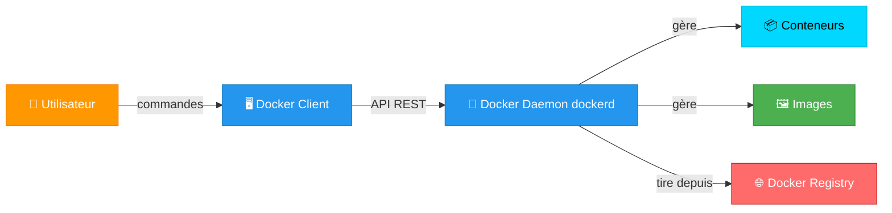
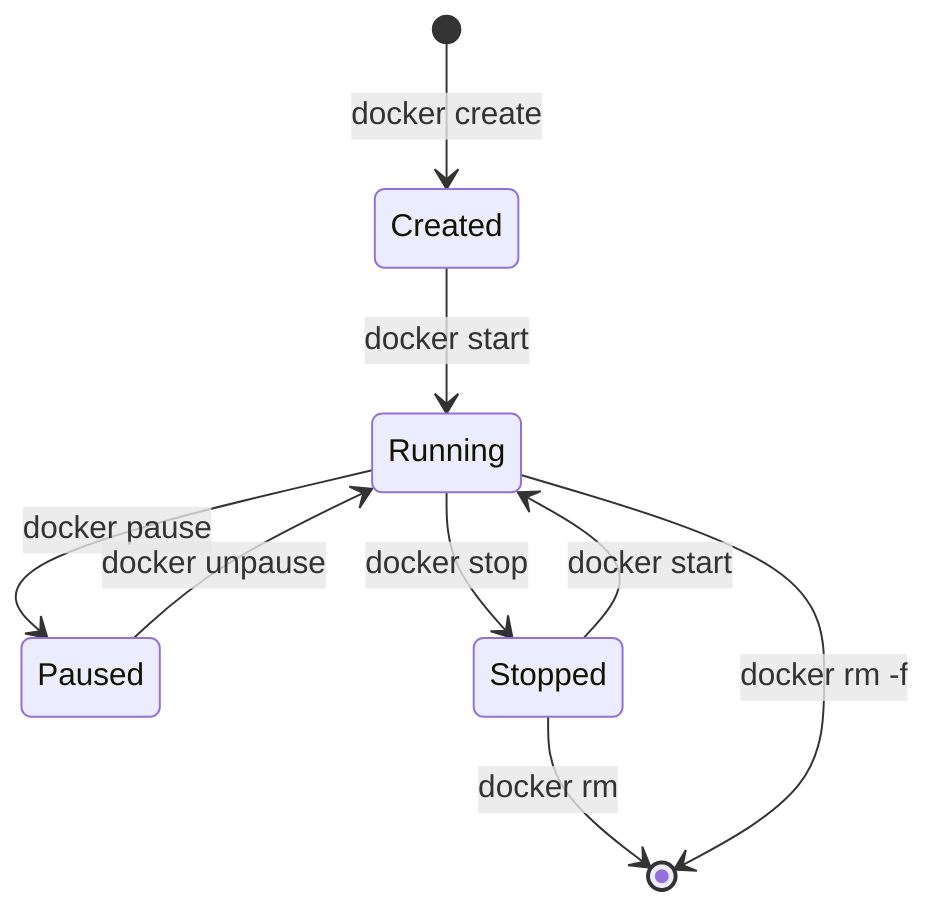
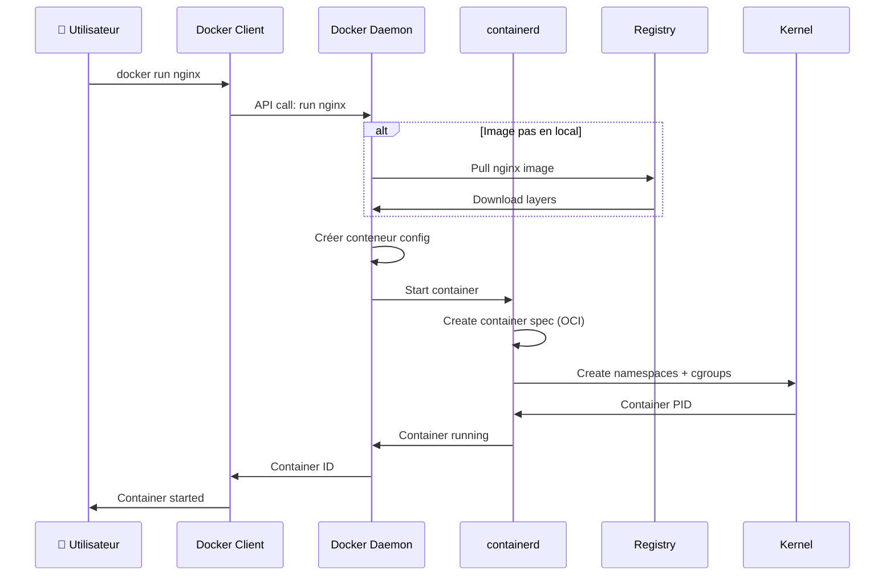

# 🏗️ Architecture Docker

## Vue d'ensemble

Docker fonctionne selon une **architecture client-serveur**. Lorsque vous exécutez une commande `docker`, plusieurs composants entrent en jeu.



## Les composants principaux

### 1. Docker Client (`docker`)

**Ce que c'est :**
- L'interface en ligne de commande (CLI)
- Ce que vous utilisez quand vous tapez `docker run`, `docker build`, etc.
- Peut être sur une machine différente du daemon

**Comment ça fonctionne :**
```bash
# Vous tapez une commande
docker run nginx

# Le client Docker envoie la commande au daemon via l'API REST
# Le daemon exécute l'action et renvoie le résultat
```

**Communication :**
- Via socket UNIX : `/var/run/docker.sock` (Linux)
- Via TCP (pour machines distantes)
- Via named pipe (Windows)

**Exemple de connexion à un daemon distant :**
```bash
docker -H tcp://192.168.1.100:2375 run nginx
```

### 2. Docker Daemon (`dockerd`)

**Ce que c'est :**
- Le **cœur de Docker**
- Service qui tourne en arrière-plan
- Gère tous les objets Docker (images, conteneurs, réseaux, volumes)

**Responsabilités :**
- ✅ Écoute les requêtes de l'API Docker
- ✅ Gère le cycle de vie des conteneurs
- ✅ Construit les images
- ✅ Gère les réseaux et volumes
- ✅ Communique avec le registry pour pull/push d'images
- ✅ Interagit avec **containerd** pour exécuter les conteneurs

**Vérifier que le daemon tourne :**
```bash
# Sur Linux (systemd)
sudo systemctl status docker

# Voir les infos du daemon
docker info
```

### 3. containerd

**Ce que c'est :**
- Runtime de conteneurs high-level
- Utilisé par Docker pour gérer le cycle de vie des conteneurs
- Projet CNCF (Cloud Native Computing Foundation)

**Relation avec Docker :**
```
docker (client)
    ↓
dockerd (daemon)
    ↓
containerd (runtime high-level)
    ↓
runc (runtime low-level)
    ↓
Linux kernel (namespaces, cgroups)
```

**Note :** containerd peut aussi être utilisé **directement par Kubernetes** (sans Docker).

### 4. Docker Images

**Ce que c'est :**
- **Templates en lecture seule** pour créer des conteneurs
- Composées de **layers** (couches) empilées
- Stockées localement ou sur un registry

**Structure en layers :**
```
nginx:latest
├── Layer 5: nginx configuration   ← 5 KB
├── Layer 4: nginx binary          ← 50 MB
├── Layer 3: Python + pip          ← 200 MB
├── Layer 2: apt packages          ← 100 MB
└── Layer 1: Base Ubuntu           ← 80 MB
```

**Avantages des layers :**
- ✅ Réutilisation (économie d'espace disque)
- ✅ Cache lors du build
- ✅ Partage entre images

**Exemple :**
Si vous avez 10 images basées sur `ubuntu:22.04`, la layer Ubuntu n'est téléchargée qu'**une seule fois** !

**Voir les layers d'une image :**
```bash
docker history nginx:latest
```

### 5. Docker Containers

**Ce que c'est :**
- **Instance exécutable** d'une image
- Environnement isolé qui tourne sur l'hôte
- Éphémère par défaut (données perdues à la suppression)

**Anatomie d'un conteneur :**
```
Conteneur = Image (read-only) + Writable Layer
```

Quand vous lancez un conteneur, Docker :
1. Prend l'image (read-only)
2. Ajoute une **writable layer** au-dessus
3. Toute modification est écrite dans cette layer
4. À la suppression du conteneur, la writable layer est **détruite**

**États d'un conteneur :**


### 6. Docker Registry

**Ce que c'est :**
- **Dépôt d'images Docker**
- Permet de stocker et distribuer des images
- Peut être public (Docker Hub) ou privé

**Docker Hub (registry par défaut) :**
- Plus de 100 000 images publiques
- Images officielles (nginx, mysql, redis, etc.)
- Gratuit pour images publiques

**Registries privés :**
- AWS ECR (Elastic Container Registry)
- Google GCR (Google Container Registry)
- Azure ACR (Azure Container Registry)
- Harbor, GitLab Container Registry, etc.

**Workflow avec registry :**
```bash
# 1. Build une image localement
docker build -t monapp:1.0 .

# 2. Tag pour le registry
docker tag monapp:1.0 docker.io/username/monapp:1.0

# 3. Login au registry
docker login

# 4. Push vers le registry
docker push username/monapp:1.0

# 5. Pull depuis le registry (sur un autre serveur)
docker pull username/monapp:1.0
```

## Flow complet : De la commande à l'exécution

### Exemple : `docker run nginx`



**Détails étape par étape :**

1. **Vous tapez** : `docker run nginx`

2. **Docker Client** envoie la commande au daemon via l'API REST

3. **Docker Daemon** vérifie si l'image `nginx` existe en local
   ```bash
   docker images | grep nginx
   ```

4. **Si l'image n'existe pas**, le daemon la télécharge depuis Docker Hub
   ```
   Pulling from library/nginx
   Layer 1/5: Downloading [=====>  ] 10 MB / 50 MB
   Layer 2/5: Downloading [==>     ] 5 MB / 100 MB
   ...
   ```

5. **Docker Daemon** crée un conteneur à partir de l'image

6. **containerd** est appelé pour gérer le cycle de vie du conteneur

7. **runc** (runtime OCI) crée les namespaces et cgroups Linux

8. **Le conteneur démarre** avec le processus nginx

9. **Docker Client** affiche l'ID du conteneur

### Vérification
```bash
# Voir le conteneur en cours d'exécution
docker ps

# Voir les logs
docker logs <container-id>

# Inspecter le conteneur
docker inspect <container-id>
```

## Architecture réseau simplifiée

Par défaut, Docker crée un **réseau bridge** :

```
┌─────────────────────────────────────────────┐
│           Host Machine                      │
│                                             │
│  ┌────────────────────────────────────┐    │
│  │     Docker Bridge (docker0)        │    │
│  │     IP: 172.17.0.1                 │    │
│  │                                    │    │
│  │  ┌──────────┐      ┌──────────┐   │    │
│  │  │Container1│      │Container2│   │    │
│  │  │172.17.0.2│      │172.17.0.3│   │    │
│  │  └────┬─────┘      └────┬─────┘   │    │
│  │       │                 │          │    │
│  └───────┼─────────────────┼──────────┘    │
│          │                 │                │
│  ┌───────▼─────────────────▼──────────┐    │
│  │       Physical Network Interface   │    │
│  │       eth0: 192.168.1.100          │    │
│  └────────────────────────────────────┘    │
└─────────────────────────────────────────────┘
```

**Communication :**
- Conteneurs sur le même réseau → Communiquent directement
- Conteneur vers Internet → Via NAT (Network Address Translation)
- Internet vers conteneur → Via port mapping (`-p`)

## Architecture de stockage

```
/var/lib/docker/
├── containers/          ← Données des conteneurs
│   └── <container-id>/
│       ├── config.json
│       ├── hostconfig.json
│       └── logs/
├── images/              ← Métadonnées des images
├── overlay2/            ← Layers du filesystem
│   ├── <layer-id>/
│   └── ...
├── volumes/             ← Volumes Docker
│   └── <volume-name>/
└── networks/            ← Configuration réseau
```

## Docker vs containerd vs Kubernetes

### Docker seul
```
User → Docker CLI → Docker Daemon → containerd → runc
```

### Kubernetes avec Docker (déprécié)
```
kubectl → Kubernetes → dockershim → Docker → containerd → runc
```

### Kubernetes moderne (sans Docker)
```
kubectl → Kubernetes → CRI → containerd → runc
```

**Pourquoi retirer Docker ?**
- Layer supplémentaire inutile (dockershim)
- Kubernetes n'a besoin que de containerd
- Simplification de la stack

## Commandes utiles pour explorer l'architecture

```bash
# Voir les infos du daemon
docker info

# Version de tous les composants
docker version

# Événements en temps réel
docker events

# Utilisation des ressources
docker stats

# Inspecter un objet (conteneur, image, volume, réseau)
docker inspect <object>

# Voir les processus dans un conteneur
docker top <container>

# Voir les modifications du filesystem
docker diff <container>
```

## Résumé : Les 6 composants clés

| Composant | Rôle | Commande |
|-----------|------|----------|
| **Docker Client** | Interface CLI | `docker run`, `docker build` |
| **Docker Daemon** | Moteur qui gère tout | `dockerd` |
| **containerd** | Runtime high-level | Géré par dockerd |
| **Images** | Templates read-only | `docker images` |
| **Containers** | Instances exécutables | `docker ps` |
| **Registry** | Dépôt d'images | Docker Hub, ECR, GCR |

---

→ [[04-Installation|Installation de Docker]]
← [[02-Conteneurs-vs-VMs|Conteneurs vs VMs]]
