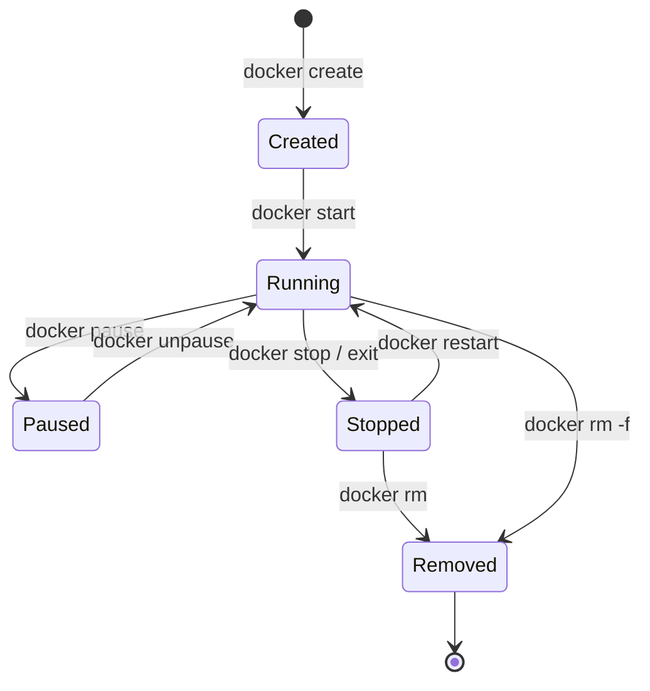

# 📖 Concepts clés de Docker

## 1. Images Docker 🖼️

### Définition

Une **image Docker** est un **template immuable** (en lecture seule) qui contient tout ce dont une application a besoin pour s'exécuter :
- Code de l'application
- Runtime (Node.js, Python, Java, etc.)
- Bibliothèques système
- Dépendances
- Fichiers de configuration

### Analogie

Pensez à une image comme à :
- Une **recette de cuisine** (instructions pour créer un plat)
- Un **ISO d'installation** d'un système d'exploitation
- Un **moule** pour créer des objets identiques

### Caractéristiques

✅ **Immuable** : Une fois créée, elle ne change jamais
✅ **Portable** : Fonctionne partout où Docker tourne
✅ **Versionnable** : Utilise des tags (`nginx:1.21`, `nginx:latest`)
✅ **Composée de layers** : Structure en couches réutilisables

### Structure en layers (couches)

```
Image nginx:latest
├─ Layer 5: Configuration nginx          (10 KB)
├─ Layer 4: Nginx binary                 (50 MB)
├─ Layer 3: Dépendances système          (100 MB)
├─ Layer 2: Outils de base (curl, etc.)  (80 MB)
└─ Layer 1: Base Ubuntu 22.04            (77 MB)
```

**Avantages :**
- 📦 **Réutilisation** : Si 10 images utilisent Ubuntu 22.04, la layer de base n'est stockée qu'**une fois**
- ⚡ **Cache** : Lors du build, les layers non modifiées sont réutilisées
- 🚀 **Optimisation** : Téléchargement uniquement des layers manquantes

### Commandes essentielles

```bash
# Lister les images locales
docker images

# Télécharger une image
docker pull nginx:latest

# Supprimer une image
docker rmi nginx:latest

# Voir l'historique des layers
docker history nginx:latest

# Voir les détails d'une image
docker inspect nginx:latest
```

### Nomenclature des images

```
[registry/][namespace/]repository[:tag]
```

**Exemples :**

| Image complète | Registry | Namespace | Repository | Tag |
|----------------|----------|-----------|------------|-----|
| `nginx` | docker.io | library | nginx | latest (implicite) |
| `nginx:1.21` | docker.io | library | nginx | 1.21 |
| `mysql:8.0` | docker.io | library | mysql | 8.0 |
| `ubuntu:22.04` | docker.io | library | ubuntu | 22.04 |
| `myuser/myapp:v1.0` | docker.io | myuser | myapp | v1.0 |
| `gcr.io/project/image:tag` | gcr.io | project | image | tag |

**Par défaut :**
- Registry = `docker.io` (Docker Hub)
- Namespace = `library` (images officielles)
- Tag = `latest`

---

## 2. Conteneurs Docker 📦

### Définition

Un **conteneur** est une **instance exécutable** d'une image Docker. C'est un processus isolé qui tourne sur votre système.

### Analogie

- **Image** = Classe (en programmation orientée objet)
- **Conteneur** = Instance de la classe

### Relation Image ↔ Conteneur

```
Image nginx:latest (template read-only)
    ↓
    ↓ docker run
    ↓
Conteneur 1      Conteneur 2      Conteneur 3
(instance 1)     (instance 2)     (instance 3)
```

**Une image** → **Plusieurs conteneurs**

### Anatomie d'un conteneur

```
┌────────────────────────────────────┐
│  Container Writable Layer          │  ← Modifications
├────────────────────────────────────┤
│  Image Layers (read-only)          │  ← Image de base
│  └─ Layer 3                        │
│  └─ Layer 2                        │
│  └─ Layer 1                        │
└────────────────────────────────────┘
```

- **Image layers** (read-only) : Partagées entre tous les conteneurs
- **Writable layer** : Unique à chaque conteneur, contient les modifications

**Conséquence :** Si vous supprimez le conteneur, la **writable layer est perdue** !

### Cycle de vie d'un conteneur



### Commandes essentielles

```bash
# Créer et démarrer un conteneur
docker run nginx

# Créer sans démarrer
docker create nginx

# Lister les conteneurs en cours
docker ps

# Lister tous les conteneurs (même arrêtés)
docker ps -a

# Arrêter un conteneur
docker stop <container-id>

# Démarrer un conteneur arrêté
docker start <container-id>

# Redémarrer
docker restart <container-id>

# Supprimer un conteneur
docker rm <container-id>

# Supprimer un conteneur en cours d'exécution
docker rm -f <container-id>

# Voir les logs
docker logs <container-id>

# Suivre les logs en temps réel
docker logs -f <container-id>

# Exécuter une commande dans un conteneur en cours
docker exec -it <container-id> bash
```

---

## 3. Dockerfile 📝

### Définition

Un **Dockerfile** est un **fichier texte** contenant les **instructions** pour construire une image Docker.

### Analogie

- C'est la **recette de cuisine** pour créer votre image
- Chaque instruction = une étape de la recette

### Structure de base

```dockerfile
# Commentaire
FROM ubuntu:22.04                    # Image de base

RUN apt-get update && \              # Exécuter des commandes
    apt-get install -y nginx

COPY index.html /var/www/html/       # Copier des fichiers

WORKDIR /app                         # Définir le répertoire de travail

ENV PORT=8080                        # Variables d'environnement

EXPOSE 80                            # Documenter le port exposé

CMD ["nginx", "-g", "daemon off;"]   # Commande par défaut
```

### Instructions principales

| Instruction | Description | Exemple |
|-------------|-------------|---------|
| `FROM` | Image de base | `FROM node:18` |
| `RUN` | Exécuter une commande (pendant le build) | `RUN npm install` |
| `COPY` | Copier des fichiers locaux → image | `COPY . /app` |
| `ADD` | Comme COPY, mais supporte URLs et extraction tar | `ADD app.tar.gz /app` |
| `WORKDIR` | Définir le répertoire de travail | `WORKDIR /app` |
| `ENV` | Variable d'environnement | `ENV NODE_ENV=production` |
| `EXPOSE` | Documenter les ports utilisés | `EXPOSE 3000` |
| `CMD` | Commande par défaut (run) | `CMD ["node", "server.js"]` |
| `ENTRYPOINT` | Point d'entrée (ne peut pas être override facilement) | `ENTRYPOINT ["python"]` |

### Exemple complet : Application Node.js

```dockerfile
# 1. Image de base
FROM node:18-alpine

# 2. Métadonnées
LABEL maintainer="dev@example.com"
LABEL version="1.0"

# 3. Définir le répertoire de travail
WORKDIR /app

# 4. Copier les fichiers de dépendances
COPY package*.json ./

# 5. Installer les dépendances
RUN npm ci --only=production

# 6. Copier le code source
COPY . .

# 7. Exposer le port
EXPOSE 3000

# 8. Définir la commande de démarrage
CMD ["node", "server.js"]
```

### Build d'une image

```bash
# Build de base
docker build -t mon-app:1.0 .

# Build avec contexte spécifique
docker build -t mon-app:1.0 -f Dockerfile.prod .

# Build sans cache
docker build --no-cache -t mon-app:1.0 .

# Build avec arguments
docker build --build-arg VERSION=1.0 -t mon-app:1.0 .
```

**Explication :**
- `-t mon-app:1.0` : Nom et tag de l'image
- `.` : Contexte de build (répertoire courant)
- `-f` : Spécifier un Dockerfile différent
- `--build-arg` : Passer des arguments au build

---

## 4. Docker Hub 🌐

### Définition

**Docker Hub** est le **registry public** par défaut de Docker. C'est un dépôt centralisé d'images Docker.

### Analogie

- Comme **GitHub** pour le code source
- Comme **npm** pour les packages Node.js
- Comme **PyPI** pour Python

### Fonctionnalités

✅ Images officielles (nginx, mysql, postgres, redis, etc.)
✅ Images de la communauté
✅ Versioning avec tags
✅ Automated builds (lié à GitHub/Bitbucket)
✅ Webhooks

### Images officielles vs communauté

**Image officielle :**
```
nginx          ← Maintenu par Docker Inc. ou l'éditeur officiel
mysql
redis
```

**Image de la communauté :**
```
username/nginx-custom   ← Créé par un utilisateur
myorg/internal-app
```

### Commandes Docker Hub

```bash
# Rechercher une image
docker search nginx

# Télécharger une image
docker pull nginx:1.21

# Login à Docker Hub
docker login

# Tag une image pour le push
docker tag mon-app:1.0 username/mon-app:1.0

# Push vers Docker Hub
docker push username/mon-app:1.0

# Logout
docker logout
```

### Workflow complet

```bash
# 1. Build votre image
docker build -t mon-app:1.0 .

# 2. Tester localement
docker run -p 3000:3000 mon-app:1.0

# 3. Tag pour Docker Hub
docker tag mon-app:1.0 username/mon-app:1.0

# 4. Login
docker login

# 5. Push
docker push username/mon-app:1.0

# 6. Sur un autre serveur
docker pull username/mon-app:1.0
docker run -p 3000:3000 username/mon-app:1.0
```

---

## 5. Layers (Couches) 📚

### Principe

Chaque instruction dans un Dockerfile crée une **nouvelle layer**.

### Exemple

```dockerfile
FROM ubuntu:22.04        # Layer 1: Base Ubuntu (77 MB)
RUN apt-get update       # Layer 2: Mise à jour des paquets (50 MB)
RUN apt-get install -y nginx   # Layer 3: Installation nginx (60 MB)
COPY index.html /var/www/html/ # Layer 4: Copie fichier (5 KB)
```

### Visualiser les layers

```bash
docker history nginx:latest
```

Résultat :
```
IMAGE          CREATED       CREATED BY                                      SIZE
abc123         2 days ago    CMD ["nginx" "-g" "daemon off;"]                0B
def456         2 days ago    EXPOSE map[80/tcp:{}]                           0B
ghi789         2 days ago    COPY index.html /var/www/html/                  5KB
jkl012         2 days ago    RUN apt-get install -y nginx                    60MB
mno345         2 days ago    RUN apt-get update                              50MB
pqr678         3 weeks ago   /bin/sh -c #(nop)  CMD ["/bin/bash"]            0B
stu901         3 weeks ago   /bin/sh -c mkdir -p /run/systemd                77MB
```

### Optimisation : Réduire le nombre de layers

❌ **Mauvais (plusieurs layers) :**
```dockerfile
RUN apt-get update
RUN apt-get install -y nginx
RUN apt-get install -y curl
RUN rm -rf /var/lib/apt/lists/*
```

✅ **Bon (une seule layer) :**
```dockerfile
RUN apt-get update && \
    apt-get install -y nginx curl && \
    rm -rf /var/lib/apt/lists/*
```

### Cache des layers

Docker **réutilise** les layers en cache si rien n'a changé.

```dockerfile
FROM node:18
COPY package*.json ./    # Layer cachée si package.json n'a pas changé
RUN npm install          # Layer cachée grâce au cache précédent
COPY . .                 # Nouvelle layer si le code a changé
```

**Best practice :** Copier `package.json` **avant** le code pour bénéficier du cache lors des builds.

---

## Résumé des concepts

| Concept | Définition | Analogie |
|---------|------------|----------|
| **Image** | Template immuable | Recette de cuisine |
| **Conteneur** | Instance d'une image | Plat cuisiné à partir de la recette |
| **Dockerfile** | Instructions pour créer une image | Recette écrite |
| **Docker Hub** | Registry public d'images | GitHub pour Docker |
| **Layer** | Couche d'une image | Étape de la recette |

---

→ [[../02-Commandes-de-base/00-INDEX|Chapitre 2 : Commandes de base]]
← [[04-Installation|Installation de Docker]]
