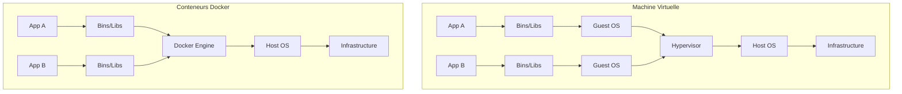
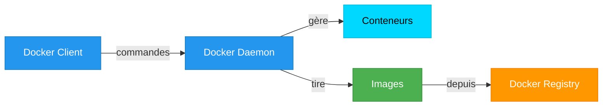

# 🐳 Qu'est-ce que Docker ?

## Définition

**Docker** est une plateforme open-source qui permet de **conteneuriser** des applications, c'est-à-dire de les empaqueter avec toutes leurs dépendances dans des unités standardisées appelées **conteneurs**.

## Le problème avant Docker

### "Ça marche sur ma machine !" 🤷

```
Développeur : "Le code fonctionne parfaitement !"
Ops : "Ça ne marche pas en production..."
```

**Causes courantes :**
- Versions de dépendances différentes
- Configuration système différente
- Bibliothèques manquantes
- Variables d'environnement différentes

## La solution : Les conteneurs

### Conteneur vs Machine Virtuelle



### Différences clés

| Aspect | Machine Virtuelle | Conteneur Docker |
|--------|------------------|------------------|
| **Taille** | Go (plusieurs gigaoctets) | Mo (quelques mégaoctets) |
| **Démarrage** | Minutes | Secondes |
| **OS** | OS complet pour chaque VM | Partage le kernel de l'hôte |
| **Isolation** | Isolation complète | Isolation des processus |
| **Performance** | Overhead important | Proche du natif |

## Avantages de Docker

### 1. 📦 Portabilité
```
Développement (Mac) → Test (Linux) → Production (Cloud)
              Même conteneur partout !
```

### 2. ⚡ Légèreté et rapidité
- Démarrage en quelques secondes
- Consommation minimale de ressources
- Pas de duplication d'OS

### 3. 🔧 Isolation
- Chaque conteneur est isolé
- Pas de conflits de dépendances
- Sécurité renforcée

### 4. 📈 Scalabilité
- Facile de lancer plusieurs instances
- Orchestration avec Kubernetes
- Load balancing automatique

### 5. 🚀 DevOps et CI/CD
- Intégration continue simplifiée
- Déploiement continu
- Infrastructure as Code

## Architecture Docker



### Composants principaux

1. **Docker Client** : Interface en ligne de commande (`docker`)
2. **Docker Daemon** : Service qui gère les conteneurs (`dockerd`)
3. **Docker Images** : Templates pour créer des conteneurs
4. **Docker Containers** : Instances exécutables des images
5. **Docker Registry** : Dépôt d'images (Docker Hub, registries privés)

## Concepts clés

### Image Docker 🖼️
- **Template en lecture seule**
- Contient l'application + dépendances
- Composée de layers (couches)
- Versionnable avec des tags

Exemple : `nginx:1.21`, `ubuntu:22.04`, `python:3.11`

### Conteneur Docker 📦
- **Instance exécutable d'une image**
- Environnement isolé
- Peut être démarré, arrêté, supprimé
- Éphémère par défaut (données perdues à la suppression)

### Dockerfile 📝
- **Fichier de recette** pour construire une image
- Instructions en texte brut
- Permet la reproductibilité

```dockerfile
FROM ubuntu:22.04
RUN apt-get update && apt-get install -y nginx
COPY index.html /var/www/html/
CMD ["nginx", "-g", "daemon off;"]
```

### Docker Hub 🌐
- **Registry public** d'images Docker
- Des millions d'images disponibles
- Images officielles (nginx, mysql, redis, etc.)

## Cas d'usage

### 1. Développement local
```bash
# Lancer une base de données PostgreSQL localement
docker run -d -p 5432:5432 -e POSTGRES_PASSWORD=secret postgres:15
```

### 2. Microservices
- Chaque service dans son propre conteneur
- Communication via réseau Docker
- Orchestration avec Docker Compose ou Kubernetes

### 3. CI/CD
```yaml
# Pipeline GitLab CI
test:
  image: node:18
  script:
    - npm install
    - npm test
```

### 4. Environnements de test
- Environnement identique à la production
- Tests d'intégration reproductibles
- Nettoyage facile après les tests

## Commandes de base

```bash
# Voir la version de Docker
docker version

# Lancer un conteneur
docker run hello-world

# Lister les conteneurs en cours
docker ps

# Lister toutes les images
docker images

# Arrêter un conteneur
docker stop <container_id>

# Supprimer un conteneur
docker rm <container_id>
```

## 📚 Ressources

- [Site officiel Docker](https://www.docker.com/)
- [Documentation Docker](https://docs.docker.com/)
- [Docker Hub](https://hub.docker.com/)
- [KodeKloud - Docker Course](https://notes.kodekloud.com/docs/Docker-Training-Course-for-the-Absolute-Beginner/)

---

**Prochaine étape : [[02-Installation-Docker|Installation de Docker]] →**
