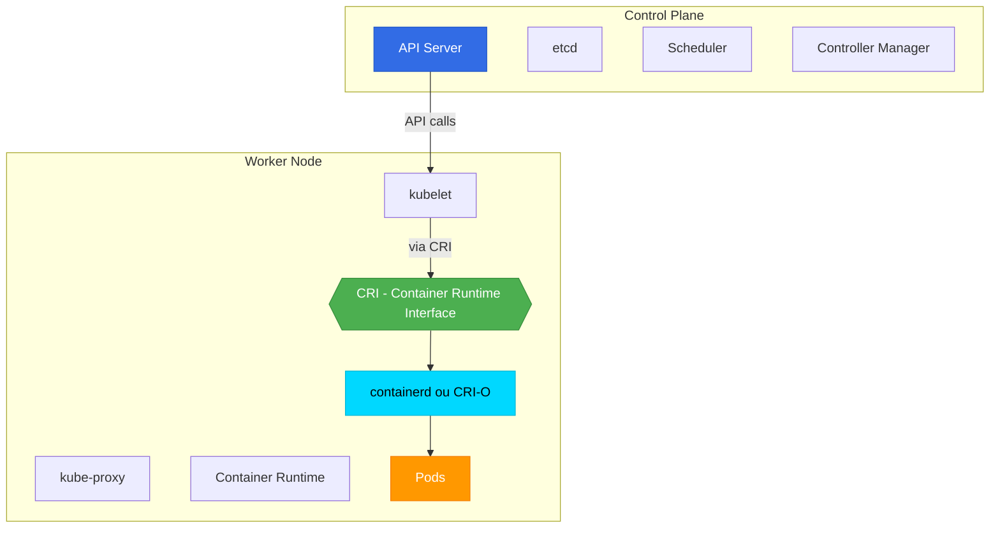

# ☸️ Kubernetes Core

> Le cœur de Kubernetes - Cours principal

## 📌 Section principale

Ceci est la **section principale** du cours Kubernetes. Vous allez apprendre tous les concepts fondamentaux pour déployer et gérer des applications conteneurisées avec Kubernetes.

## 📑 Chapitres

### [[01-Introduction/00-INDEX|01 - Introduction à Kubernetes]]
- Qu'est-ce que Kubernetes ?
- Pourquoi l'orchestration de conteneurs ?
- Historique (Borg, Docker Swarm vs K8s)
- Cas d'usage et écosystème

### [[02-Architecture/00-INDEX|02 - Architecture Kubernetes]]
- Control Plane (kube-apiserver, etcd, scheduler, controller-manager)
- Worker Nodes (kubelet, kube-proxy, container runtime)
- Communication entre composants
- **Focus sur le rôle du Container Runtime et CRI**

### [[03-Installation/00-INDEX|03 - Installation et Configuration]]
- Minikube (environnement local)
- Kind (Kubernetes in Docker)
- Kubeadm (production)
- kubectl (CLI)
- Managed Kubernetes (EKS, GKE, AKS)

### [[04-Pods/00-INDEX|04 - Pods]]
- Comprendre les Pods
- Lifecycle d'un Pod
- Multi-container Pods
- Init containers
- Commandes et manifests YAML

### [[05-Workloads/00-INDEX|05 - Workloads]]
- ReplicaSets
- Deployments
- StatefulSets
- DaemonSets
- Jobs et CronJobs
- Stratégies de déploiement (Rolling update, Recreate, Blue/Green, Canary)

### [[06-Services-et-Reseaux/00-INDEX|06 - Services et Réseaux]]
- Modèle réseau Kubernetes
- Types de Services (ClusterIP, NodePort, LoadBalancer, ExternalName)
- Endpoints et EndpointSlices
- Ingress Controllers
- DNS Kubernetes
- Network Policies

### [[07-Storage/00-INDEX|07 - Storage]]
- Volumes
- PersistentVolumes (PV)
- PersistentVolumeClaims (PVC)
- StorageClasses
- Dynamic Provisioning

### [[08-ConfigMaps-Secrets/00-INDEX|08 - ConfigMaps et Secrets]]
- ConfigMaps (configuration)
- Secrets (données sensibles)
- Injection dans les Pods
- Best practices de sécurité

### [[09-Deployments-Avances/00-INDEX|09 - Déploiements Avancés]]
- Scaling horizontal (HPA)
- Resource Limits et Requests
- Liveness, Readiness, Startup Probes
- Affinity et Anti-affinity
- Taints et Tolerations
- PodDisruptionBudgets

## 🎯 Objectifs d'apprentissage

À la fin de ce module, vous serez capable de :

✅ Comprendre l'architecture complète de Kubernetes
✅ Déployer des applications dans un cluster
✅ Gérer le cycle de vie des applications
✅ Configurer le réseau et les services
✅ Gérer la persistance des données
✅ Implémenter des déploiements avancés
✅ **Comprendre comment Kubernetes communique avec containerd/CRI-O via CRI**

## 🗺️ Architecture simplifiée Kubernetes

## 🔗 Lien avec les autres sections

- **Avant** : [[00-Rappels-Docker/00-INDEX|Rappels Docker]] - Assurez-vous de comprendre les conteneurs
- **Approfondir** : [[02-Runtimes-et-CRI/00-INDEX|Runtimes & CRI]] - Plongée technique dans containerd, CRI-O, runc
- **Pratiquer** : [[04-Exercices-Pratiques/00-INDEX|Exercices]] - Labs Kubernetes

## 🔗 Ressources

- [KodeKloud - Kubernetes Course](https://notes.kodekloud.com/docs/kubernetes-for-the-absolute-beginners-hands-on-tutorial/)
- [Documentation officielle Kubernetes](https://kubernetes.io/docs/)
- [Kubernetes Playground](https://labs.play-with-k8s.com/)

---

**Commencer → [[01-Introduction/01-Quest-ce-que-Kubernetes|Qu'est-ce que Kubernetes ?]]**
