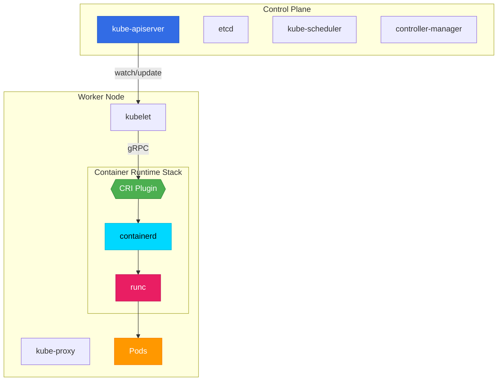

# 🏗️ Architecture Kubernetes

> Comprendre les composants d'un cluster Kubernetes

## Contenu du chapitre

### [[01-Vue-Ensemble|🗺️ Vue d'ensemble]]
- Architecture globale
- Control Plane vs Data Plane
- Communication entre composants

### [[02-Control-Plane|🧠 Control Plane (Master)]]
- kube-apiserver
- etcd
- kube-scheduler
- kube-controller-manager
- cloud-controller-manager (optionnel)

### [[03-Worker-Nodes|💪 Worker Nodes]]
- kubelet
- kube-proxy
- **Container Runtime (focus CRI)**

### [[04-Container-Runtime-et-CRI|⚙️ Container Runtime et CRI]]
- Qu'est-ce qu'un Container Runtime ?
- **Interface CRI (Container Runtime Interface)**
- containerd vs CRI-O vs Docker
- Comment kubelet communique avec le runtime via CRI
- Déprécation de dockershim

### [[05-Networking|🌐 Networking]]
- CNI (Container Network Interface)
- Pod network
- Service network
- DNS Kubernetes (CoreDNS)

### [[06-Addons|🔌 Add-ons]]
- DNS (CoreDNS)
- Dashboard
- Monitoring (Metrics Server)
- Logging

## 🎯 Objectifs

À la fin de ce chapitre, vous comprendrez :
- ✅ Les composants du Control Plane
- ✅ Les composants des Worker Nodes
- ✅ **Le rôle de CRI et comment Kubernetes interagit avec containerd/CRI-O**
- ✅ Le flow complet d'un Pod de la création à l'exécution
- ✅ Le modèle réseau Kubernetes

## 🗺️ Architecture simplifiée avec CRI

**Point clé :** Kubernetes ne parle **jamais directement** à containerd ou Docker. Il passe toujours par l'interface **CRI** !

---

**Commencer → [[01-Vue-Ensemble|Vue d'ensemble]]**
