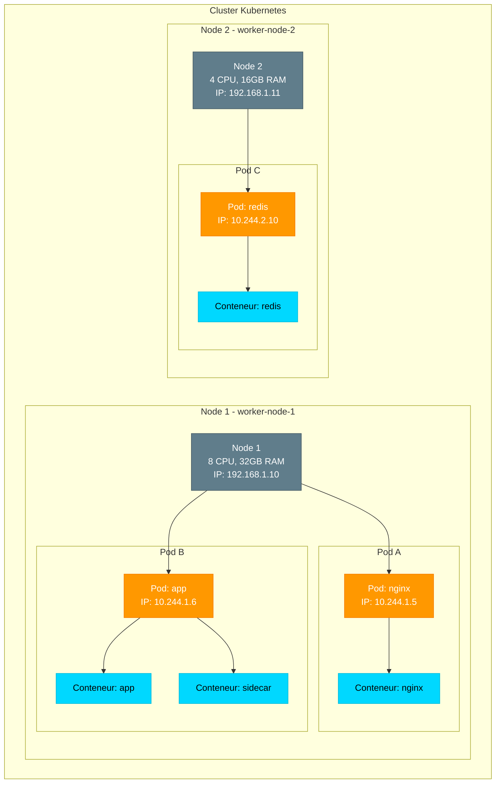

# 🏢 Pods vs Nodes - La différence expliquée simplement

> Comprendre la différence entre un Node et un Pod, les deux concepts fondamentaux de Kubernetes

## ❓ La confusion classique

Quand on débute avec Kubernetes, on entend parler de **Nodes** et de **Pods**, et c'est souvent confus :
- "Un Pod tourne sur un Node ?"
- "Un Node contient des Pods ?"
- "C'est quoi la différence exactement ?"

**Réponse courte :** Un **Node** est une **machine** (serveur physique ou VM). Un **Pod** est un **groupe de conteneurs** qui tournent ensemble sur cette machine.

Mais allons plus loin avec des analogies concrètes !

---

## 🏢 Analogie de l'immeuble

Imaginez un **immeuble** :

```
┌─────────────────────────────────────────────┐
│           🏢 IMMEUBLE (Node)                │
│                                             │
│  ┌─────────────────────────────────────┐   │
│  │  🚪 Appartement 1 (Pod)             │   │
│  │  ┌─────────┐  ┌─────────┐          │   │
│  │  │ Chambre │  │ Cuisine │          │   │
│  │  │(Conteneur)│ │(Conteneur)        │   │
│  │  └─────────┘  └─────────┘          │   │
│  └─────────────────────────────────────┘   │
│                                             │
│  ┌─────────────────────────────────────┐   │
│  │  🚪 Appartement 2 (Pod)             │   │
│  │  ┌─────────┐                        │   │
│  │  │  Salon  │                        │   │
│  │  │(Conteneur)                       │   │
│  │  └─────────┘                        │   │
│  └─────────────────────────────────────┘   │
│                                             │
│  ┌─────────────────────────────────────┐   │
│  │  🚪 Appartement 3 (Pod)             │   │
│  │  ┌────┐  ┌────┐  ┌────┐            │   │
│  │  │ C1 │  │ C2 │  │ C3 │            │   │
│  │  └────┘  └────┘  └────┘            │   │
│  └─────────────────────────────────────┘   │
└─────────────────────────────────────────────┘
```

### Dans cette analogie :

| Concept Kubernetes | Analogie | Explication |
|-------------------|----------|-------------|
| **Node** | 🏢 **Immeuble** | La structure physique, le bâtiment entier |
| **Pod** | 🚪 **Appartement** | Un espace dans l'immeuble où vivent des "occupants" |
| **Conteneur** | 🛏️ **Pièce** | Une pièce de l'appartement (chambre, cuisine, salon) |

**Points clés :**
- Un **immeuble** (Node) peut avoir **plusieurs appartements** (Pods)
- Un **appartement** (Pod) peut avoir **plusieurs pièces** (Conteneurs)
- Les pièces d'un même appartement **partagent** certaines ressources (eau, électricité)
- Les appartements sont **isolés** les uns des autres

---

## 📦 Définitions précises

### Node (Nœud)

**Définition :**
Un **Node** est une **machine** (physique ou virtuelle) dans un cluster Kubernetes qui exécute des charges de travail.

**Ce que c'est vraiment :**
- Un serveur Linux
- Une VM dans le cloud (AWS EC2, GCP Compute, Azure VM)
- Votre laptop avec Minikube
- Un Raspberry Pi dans votre cluster maison

**Caractéristiques :**
- Possède du CPU, de la RAM, du stockage
- Tourne un OS (généralement Linux)
- Exécute des processus Kubernetes :
  - `kubelet` (agent Kubernetes)
  - `kube-proxy` (gestion réseau)
  - Container runtime (containerd, CRI-O)

**Types de Nodes :**

| Type | Rôle | Composants |
|------|------|------------|
| **Master Node** (Control Plane) | Gère le cluster | kube-apiserver, etcd, scheduler, controller-manager |
| **Worker Node** | Exécute les Pods | kubelet, kube-proxy, container runtime |

### Pod

**Définition :**
Un **Pod** est la **plus petite unité déployable** dans Kubernetes. C'est un **groupe d'un ou plusieurs conteneurs** qui partagent des ressources.

**Ce que c'est vraiment :**
- Un ou plusieurs conteneurs Docker/containerd
- Qui tournent **ensemble** sur le même Node
- Qui partagent le même réseau (même IP)
- Qui partagent les mêmes volumes

**Caractéristiques :**
- **Éphémère** : Peut être détruit et recréé à tout moment
- **Adresse IP unique** : Chaque Pod a sa propre IP
- **Conteneurs co-localisés** : Tous les conteneurs du Pod sont sur le même Node
- **Namespace partagé** : Les conteneurs peuvent communiquer via `localhost`

---

## 🔍 Différences clés

### Node vs Pod

| Aspect | Node | Pod |
|--------|------|-----|
| **Niveau** | Infrastructure (matériel/VM) | Application (conteneurs) |
| **Durée de vie** | Long terme (tant que la machine existe) | Éphémère (peut être recréé) |
| **Création** | Provisionné par admin ou cloud | Créé par Kubernetes |
| **Contient** | Plusieurs Pods | Un ou plusieurs conteneurs |
| **IP** | IP de la machine | IP du Pod (unique dans le cluster) |
| **Ressources** | CPU, RAM, Disque physiques | Limite définie (requests/limits) |
| **Commandes** | `kubectl get nodes` | `kubectl get pods` |

### Schéma hiérarchique

```
Cluster Kubernetes
    │
    ├─ Node 1 (serveur-01)
    │    ├─ Pod A (nginx)
    │    │    └─ Conteneur nginx
    │    ├─ Pod B (app + sidecar)
    │    │    ├─ Conteneur app
    │    │    └─ Conteneur log-collector
    │    └─ Pod C (redis)
    │         └─ Conteneur redis
    │
    ├─ Node 2 (serveur-02)
    │    ├─ Pod D (mysql)
    │    │    └─ Conteneur mysql
    │    └─ Pod E (api)
    │         └─ Conteneur api
    │
    └─ Node 3 (serveur-03)
         └─ Pod F (frontend)
              └─ Conteneur react
```

---

## 🎯 Exemples concrets

### Exemple 1 : Application simple

**Vous déployez un site web nginx**

```yaml
apiVersion: v1
kind: Pod
metadata:
  name: nginx-pod
spec:
  containers:
  - name: nginx
    image: nginx:latest
```

**Ce qui se passe :**

1. Kubernetes **choisit un Node** disponible (par exemple : `worker-node-1`)
2. Sur ce Node, Kubernetes **crée un Pod** nommé `nginx-pod`
3. Dans ce Pod, Kubernetes **lance un conteneur** nginx

**Visualisation :**
```
Node: worker-node-1
  └─ Pod: nginx-pod (IP: 10.244.1.5)
       └─ Conteneur: nginx
```

**Commandes :**
```bash
# Voir les Nodes
kubectl get nodes
# NAME            STATUS   ROLE    AGE   VERSION
# worker-node-1   Ready    worker  5d    v1.28.0
# worker-node-2   Ready    worker  5d    v1.28.0

# Voir les Pods
kubectl get pods -o wide
# NAME        READY   STATUS    IP            NODE
# nginx-pod   1/1     Running   10.244.1.5    worker-node-1

# Le Pod tourne sur worker-node-1 !
```

### Exemple 2 : Application avec sidecar

**Vous déployez une app avec un conteneur de logs**

```yaml
apiVersion: v1
kind: Pod
metadata:
  name: app-with-sidecar
spec:
  containers:
  - name: main-app
    image: myapp:1.0
  - name: log-collector
    image: fluentd:latest
```

**Ce qui se passe :**

1. Kubernetes choisit un Node (par exemple : `worker-node-2`)
2. Crée **un seul Pod** : `app-with-sidecar`
3. Dans ce Pod, lance **deux conteneurs** :
   - `main-app`
   - `log-collector`

**Visualisation :**
```
Node: worker-node-2
  └─ Pod: app-with-sidecar (IP: 10.244.2.10)
       ├─ Conteneur: main-app
       └─ Conteneur: log-collector
```

**Points importants :**
- Les deux conteneurs **partagent la même IP** : `10.244.2.10`
- Ils peuvent communiquer via `localhost`
- Ils **partagent les mêmes volumes**
- Ils tournent **toujours ensemble** sur le même Node

### Exemple 3 : Deployment avec 3 replicas

**Vous déployez 3 instances de votre application**

```yaml
apiVersion: apps/v1
kind: Deployment
metadata:
  name: web-app
spec:
  replicas: 3
  template:
    spec:
      containers:
      - name: web
        image: mywebapp:1.0
```

**Ce qui se passe :**

Kubernetes crée **3 Pods** et les **distribue** sur les Nodes disponibles.

**Visualisation :**
```
Node 1: worker-node-1
  ├─ Pod: web-app-abc123 (IP: 10.244.1.10)
  │    └─ Conteneur: web
  └─ Pod: web-app-def456 (IP: 10.244.1.11)
       └─ Conteneur: web

Node 2: worker-node-2
  └─ Pod: web-app-ghi789 (IP: 10.244.2.15)
       └─ Conteneur: web
```

**Commandes :**
```bash
kubectl get pods -o wide
# NAME              READY   STATUS    IP            NODE
# web-app-abc123    1/1     Running   10.244.1.10   worker-node-1
# web-app-def456    1/1     Running   10.244.1.11   worker-node-1
# web-app-ghi789    1/1     Running   10.244.2.15   worker-node-2
```

**Points clés :**
- **3 Pods différents** (chacun avec son nom et son IP)
- Distribués sur **2 Nodes**
- Chaque Pod est **indépendant**

---

## 🤔 Questions fréquentes

### Q1 : Un Pod peut-il être sur plusieurs Nodes ?

❌ **NON !** Un Pod tourne **toujours sur un seul Node**.

Si un Node tombe en panne, le Pod est **perdu**. Kubernetes peut créer un **nouveau Pod** sur un autre Node, mais ce n'est pas le même Pod (nouveau nom, nouvelle IP).

### Q2 : Plusieurs Pods peuvent-ils être sur le même Node ?

✅ **OUI !** Un Node peut héberger **des dizaines de Pods** (limité par les ressources CPU/RAM du Node).

```
Node: worker-node-1 (8 CPU, 32GB RAM)
  ├─ Pod 1 (nginx)
  ├─ Pod 2 (redis)
  ├─ Pod 3 (api-v1)
  ├─ Pod 4 (api-v2)
  └─ ... (jusqu'à épuisement des ressources)
```

### Q3 : Peut-on choisir sur quel Node un Pod tourne ?

✅ **OUI !** Avec des mécanismes comme :

**NodeSelector** (simple) :
```yaml
spec:
  nodeSelector:
    disktype: ssd
```

**Node Affinity** (avancé) :
```yaml
spec:
  affinity:
    nodeAffinity:
      requiredDuringSchedulingIgnoredDuringExecution:
        nodeSelectorTerms:
        - matchExpressions:
          - key: zone
            operator: In
            values:
            - us-west-1a
```

**NodeName** (forcer un Node spécifique) :
```yaml
spec:
  nodeName: worker-node-1
```

### Q4 : Quand un Pod contient-il plusieurs conteneurs ?

**Cas d'usage pour multi-conteneurs dans un Pod :**

| Pattern | Exemple | Pourquoi ensemble ? |
|---------|---------|---------------------|
| **Sidecar** | App + Log collector | Le logger doit voir les logs de l'app |
| **Ambassador** | App + Proxy | Le proxy gère les connexions externes |
| **Adapter** | App + Monitoring exporter | L'exporter traduit les métriques |
| **Init containers** | Setup DB + App | Le setup doit finir avant l'app |

**Règle générale :** Si deux conteneurs **doivent absolument tourner ensemble** et **partager des ressources**, mettez-les dans le même Pod.

### Q5 : Comment les Pods communiquent entre eux ?

**Pods sur le même Node :**
```
Pod A (10.244.1.5) ──[bridge network]──> Pod B (10.244.1.6)
```

**Pods sur des Nodes différents :**
```
Node 1: Pod A (10.244.1.5)
            │
    [réseau overlay CNI]
            │
Node 2: Pod B (10.244.2.10)
```

Chaque Pod a une **IP unique** dans le cluster. Les Pods peuvent se parler directement via leurs IPs (grâce au CNI - Container Network Interface).

---

## 📊 Résumé visuel

### Architecture complète



### Tableau récapitulatif final

| Caractéristique | Node | Pod |
|----------------|------|-----|
| **C'est quoi ?** | Machine physique/VM | Groupe de conteneurs |
| **Analogie** | Immeuble | Appartement |
| **Créé par** | Admin/Cloud provider | Kubernetes |
| **Durée de vie** | Longue (jours/mois/années) | Courte (peut être recréé) |
| **Contient** | Pods | Conteneurs |
| **Localisation** | Data center / Cloud | Sur un Node spécifique |
| **IP** | IP machine (192.168.x.x) | IP Pod (10.244.x.x) |
| **Commande** | `kubectl get nodes` | `kubectl get pods` |
| **Supprimer** | Décommissionner le serveur | `kubectl delete pod` |
| **Nombre** | Quelques-uns (3-100+) | Beaucoup (10-10000+) |

---

## 🎓 Exercice de compréhension

### Question : Où tournent ces Pods ?

Vous avez :
- 2 Nodes : `node-1` et `node-2`
- 5 Pods : `pod-a`, `pod-b`, `pod-c`, `pod-d`, `pod-e`

Résultat de `kubectl get pods -o wide` :
```
NAME    NODE
pod-a   node-1
pod-b   node-1
pod-c   node-2
pod-d   node-1
pod-e   node-2
```

**Questions :**
1. Combien de Pods sur `node-1` ? → **3 Pods**
2. `pod-a` et `pod-b` partagent-ils la même IP ? → **NON** (Pods différents = IPs différentes)
3. Si `node-1` tombe, que se passe-t-il ? → **pod-a, pod-b, pod-d sont perdus**
4. Kubernetes peut-il les recréer ? → **OUI** (sur node-2 ou sur node-1 quand il revient)

---

## 💡 Conclusion

**Node = La machine**
- C'est le hardware/VM
- C'est là où tout tourne
- Géré par l'infrastructure

**Pod = Le groupe de conteneurs**
- C'est votre application
- Tourne sur un Node
- Géré par Kubernetes

**Mémo :** Les **Pods** tournent **sur** les **Nodes**, jamais l'inverse !

---

← [[00-INDEX|Retour au chapitre Pods]]
