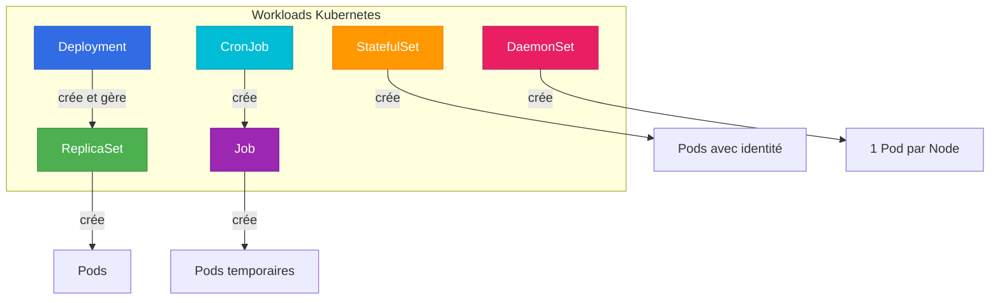

# ⚙️ Workloads - Gérer les charges de travail

> Les différents types de workloads dans Kubernetes

## 📌 Contexte

Les **Workloads** sont les ressources Kubernetes qui gèrent vos applications. Ils définissent comment vos Pods doivent être déployés, répliqués, mis à jour, etc.

## Contenu du chapitre

### [[01-ReplicaSets-vs-ReplicationControllers|🔄 ReplicaSets vs Replication Controllers]]
**⭐ Comprendre les mécanismes de réplication**

Explication complète avec :
- Définitions de ReplicaSet et Replication Controller
- Différences clés (selectors avancés)
- Pourquoi ReplicaSet a remplacé RC
- Exemples YAML détaillés
- Commandes kubectl
- Auto-healing et scaling
- Relation avec les Deployments

**À lire pour comprendre comment Kubernetes maintient vos répliques !**

### [[02-ReplicaSet-YAML-Detaille|📝 ReplicaSet - Structure YAML détaillée]]
**⭐⭐ Les subtilités du YAML ReplicaSet**

Explication approfondie :
- Structure YAML complète annotée
- **Comment matchLabels lie les Pods au ReplicaSet**
- Pourquoi les labels doivent correspondre
- Comment le ReplicaSet trouve les Pods
- **kubectl edit replicaset avec exemples pratiques**
- **kubectl scale avec exemples détaillés**
- Erreurs courantes et solutions

**À lire pour maîtriser la création et modification de ReplicaSets !**

### [[03-Deployments|🚀 Deployments]]
**Le workload le plus utilisé**
- Qu'est-ce qu'un Deployment
- Gestion des ReplicaSets
- Rolling updates
- Rollbacks
- Stratégies de déploiement
- Commandes kubectl

### [[04-StatefulSets|🎯 StatefulSets]]
**Pour les applications stateful**
- Différence avec Deployments
- Identité stable des Pods
- Volumes persistants
- Ordre de déploiement
- Cas d'usage (bases de données)

### [[05-DaemonSets|👥 DaemonSets]]
**Un Pod par Node**
- Qu'est-ce qu'un DaemonSet
- Cas d'usage (monitoring, logs, réseau)
- Commandes kubectl
- Update strategies

### [[06-Jobs|⏱️ Jobs]]
**Tâches ponctuelles**
- Qu'est-ce qu'un Job
- Tâches batch
- Parallélisme
- Retry et backoff

### [[07-CronJobs|🕐 CronJobs]]
**Tâches planifiées**
- Qu'est-ce qu'un CronJob
- Syntaxe cron
- Exemples pratiques
- Gestion des Jobs passés

## 🎯 Objectifs

À la fin de ce chapitre, vous comprendrez :
- ✅ La différence entre ReplicaSet et Replication Controller
- ✅ Comment utiliser les Deployments pour vos applications
- ✅ Quand utiliser StatefulSets vs Deployments
- ✅ Comment déployer des agents avec DaemonSets
- ✅ Comment exécuter des tâches avec Jobs et CronJobs

## 🗺️ Vue d'ensemble des Workloads



## 📊 Quel Workload choisir ?

| Type d'application | Workload recommandé |
|-------------------|-------------------|
| Application web stateless | **Deployment** |
| API REST | **Deployment** |
| Base de données | **StatefulSet** |
| Application avec état | **StatefulSet** |
| Agent de monitoring | **DaemonSet** |
| Collecteur de logs | **DaemonSet** |
| Tâche ponctuelle | **Job** |
| Backup quotidien | **CronJob** |
| Migration de DB | **Job** |

## 🔍 Hiérarchie des Workloads

### Deployment (recommandé pour 90% des cas)

```
Deployment
    ↓ gère
ReplicaSet
    ↓ crée
Pods (identiques et interchangeables)
```

**Caractéristiques :**
- ✅ Rolling updates
- ✅ Rollbacks
- ✅ Scaling
- ✅ Déclaratif
- ✅ Auto-healing

**Cas d'usage :**
- Applications web
- APIs
- Workers
- Microservices stateless

### StatefulSet (pour applications avec état)

```
StatefulSet
    ↓ crée
Pods (avec identité stable : web-0, web-1, web-2)
    ↓ chacun a son
PersistentVolume
```

**Caractéristiques :**
- ✅ Identité stable (nom + réseau)
- ✅ Volume persistant par Pod
- ✅ Ordre de déploiement garanti
- ✅ Scaling ordonné

**Cas d'usage :**
- Bases de données (MySQL, PostgreSQL, MongoDB)
- Systèmes distribués (Kafka, Zookeeper, etcd)
- Applications nécessitant un état

### DaemonSet (un Pod par Node)

```
DaemonSet
    ↓ crée
Pod sur Node-1
Pod sur Node-2
Pod sur Node-3
... (un par Node)
```

**Caractéristiques :**
- ✅ Un Pod par Node automatiquement
- ✅ Ajouté sur les nouveaux Nodes
- ✅ Supprimé si Node supprimé

**Cas d'usage :**
- Agents de monitoring (Prometheus node-exporter)
- Collecteurs de logs (Fluentd, Filebeat)
- CNI network plugins
- Storage daemons

### Job (tâche ponctuelle)

```
Job
    ↓ crée
Pods (jusqu'à succès)
    ↓ terminé
Status: Completed
```

**Caractéristiques :**
- ✅ Tâche qui se termine
- ✅ Retry automatique si échec
- ✅ Parallélisme possible

**Cas d'usage :**
- Migration de base de données
- Traitement batch
- Export de données
- Calculs ponctuels

### CronJob (tâche planifiée)

```
CronJob
    ↓ crée selon planning
Job (toutes les heures)
    ↓ crée
Pods
```

**Caractéristiques :**
- ✅ Planning avec syntaxe cron
- ✅ Crée des Jobs périodiquement
- ✅ Gestion de l'historique

**Cas d'usage :**
- Backups quotidiens
- Rapports hebdomadaires
- Nettoyage de données
- Health checks périodiques

## 📝 Exemples rapides

### Deployment
```yaml
apiVersion: apps/v1
kind: Deployment
metadata:
  name: nginx
spec:
  replicas: 3
  selector:
    matchLabels:
      app: nginx
  template:
    metadata:
      labels:
        app: nginx
    spec:
      containers:
      - name: nginx
        image: nginx:1.21
```

### ReplicaSet (géré par Deployment)
```yaml
apiVersion: apps/v1
kind: ReplicaSet
metadata:
  name: nginx-rs
spec:
  replicas: 3
  selector:
    matchLabels:
      app: nginx
  template:
    # ... spec Pod
```

### StatefulSet
```yaml
apiVersion: apps/v1
kind: StatefulSet
metadata:
  name: web
spec:
  serviceName: "nginx"
  replicas: 3
  selector:
    matchLabels:
      app: nginx
  template:
    # ... spec Pod
  volumeClaimTemplates:
  - metadata:
      name: www
    spec:
      accessModes: [ "ReadWriteOnce" ]
      resources:
        requests:
          storage: 1Gi
```

### DaemonSet
```yaml
apiVersion: apps/v1
kind: DaemonSet
metadata:
  name: fluentd
spec:
  selector:
    matchLabels:
      name: fluentd
  template:
    # ... spec Pod
```

### Job
```yaml
apiVersion: batch/v1
kind: Job
metadata:
  name: pi
spec:
  template:
    spec:
      containers:
      - name: pi
        image: perl:5.34
        command: ["perl", "-Mbignum=bpi", "-wle", "print bpi(2000)"]
      restartPolicy: Never
  backoffLimit: 4
```

### CronJob
```yaml
apiVersion: batch/v1
kind: CronJob
metadata:
  name: backup
spec:
  schedule: "0 2 * * *"  # Tous les jours à 2h
  jobTemplate:
    spec:
      template:
        spec:
          containers:
          - name: backup
            image: backup:1.0
            command: ["/scripts/backup.sh"]
          restartPolicy: OnFailure
```

## 🔗 Ressources

- [Documentation Kubernetes - Workloads](https://kubernetes.io/docs/concepts/workloads/)
- [KodeKloud - Kubernetes Course](https://kodekloud.com/courses/kubernetes-for-the-absolute-beginners/)

---

**⭐ Commencer par → [[01-ReplicaSets-vs-ReplicationControllers|ReplicaSets vs Replication Controllers]]**
