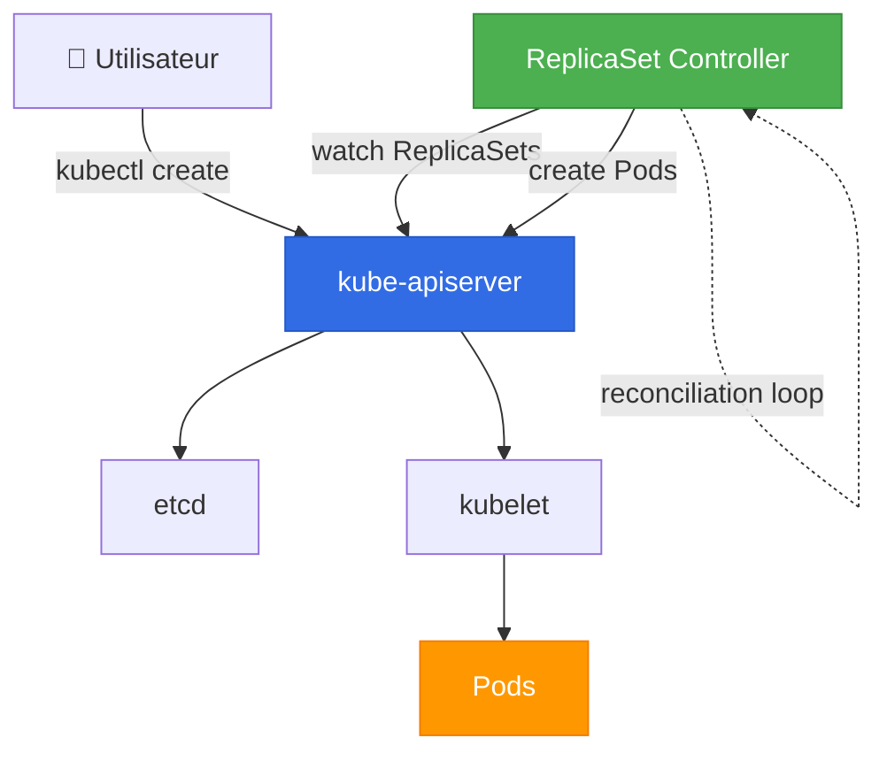

# 🔄 ReplicaSets vs Replication Controllers

> Comprendre les deux mécanismes de réplication dans Kubernetes

## ❓ La question

**"Quelle est la différence entre un ReplicaSet et un Replication Controller ?"**

**Réponse courte :** Les **ReplicaSets** sont la **nouvelle version** des Replication Controllers. Ils font la même chose, mais les ReplicaSets sont **plus flexibles** et utilisent des **selectors avancés**.

**⚠️ Aujourd'hui, on n'utilise presque jamais directement des ReplicaSets ou Replication Controllers. On utilise des **Deployments** qui gèrent les ReplicaSets automatiquement.**

---

## 📖 Définitions

### Replication Controller (RC)

**Définition :**
Le **Replication Controller** est l'ancien mécanisme de Kubernetes pour garantir qu'un nombre spécifié de répliques d'un Pod tourne en permanence.

**Créé :** Kubernetes v1.0 (2015)
**Statut :** ⚠️ **Déprécié** (remplacé par ReplicaSet)

**Ce qu'il fait :**
- Garantit qu'un nombre X de Pods identiques tournent
- Recrée automatiquement les Pods qui crashent
- Permet le scaling manuel

### ReplicaSet (RS)

**Définition :**
Le **ReplicaSet** est le successeur du Replication Controller. Il fait exactement la même chose, mais avec des selectors plus puissants.

**Créé :** Kubernetes v1.2 (2016)
**Statut :** ✅ **Recommandé** (mais via Deployments)

**Ce qu'il fait :**
- Garantit qu'un nombre X de Pods identiques tournent
- Recrée automatiquement les Pods qui crashent
- Permet le scaling manuel
- **Selectors avancés** (matchExpressions)

---

## 🔍 Différences clés

### Tableau comparatif

| Aspect | Replication Controller | ReplicaSet |
|--------|----------------------|------------|
| **API Version** | `v1` | `apps/v1` |
| **Status** | ⚠️ Déprécié | ✅ Recommandé |
| **Selectors** | Égalité uniquement (`app=nginx`) | Égalité + Set-based (`app in (nginx, web)`) |
| **Utilisé par** | Rien (legacy) | Deployments, DaemonSets |
| **Créé en** | 2015 (K8s v1.0) | 2016 (K8s v1.2) |
| **Recommandation** | Ne plus utiliser | Utiliser via Deployments |

### Différence principale : Les selectors

**Replication Controller (ancien) :**
```yaml
selector:
  app: nginx
  tier: frontend
```

**Seulement égalité** : `key=value`

**ReplicaSet (nouveau) :**
```yaml
selector:
  matchLabels:
    app: nginx
  matchExpressions:
  - key: tier
    operator: In
    values:
    - frontend
    - backend
```

**Égalité + Set-based** : `in`, `notin`, `exists`, `doesnotexist`

---

## 🎯 Pourquoi ReplicaSet a remplacé Replication Controller

### Problèmes avec Replication Controller

❌ **Selectors limités** : Seulement `key=value`
❌ **Pas de selectors avancés** : Impossible de faire `env in (dev, test)`
❌ **Difficile à maintenir** : Deux implémentations dans le code K8s
❌ **Moins flexible** : Pas de correspondance par ensemble

### Avantages des ReplicaSets

✅ **Selectors avancés** : `matchExpressions`
✅ **Plus flexible** : Peut sélectionner plusieurs valeurs
✅ **Meilleure intégration** : Utilisé par les Deployments
✅ **Architecture moderne** : API `apps/v1`

### Exemple concret de la différence

**Scénario :** Vous voulez sélectionner les Pods avec `env=dev` **OU** `env=test`

**Avec Replication Controller :**
```yaml
❌ IMPOSSIBLE !
# Vous devez créer 2 Replication Controllers séparés
```

**Avec ReplicaSet :**
```yaml
✅ FACILE !
selector:
  matchExpressions:
  - key: env
    operator: In
    values:
    - dev
    - test
```

---

## 📝 Exemples YAML

### Replication Controller (ancien - ne plus utiliser)

```yaml
apiVersion: v1
kind: ReplicationController
metadata:
  name: nginx-rc
spec:
  replicas: 3
  selector:
    app: nginx
  template:
    metadata:
      labels:
        app: nginx
    spec:
      containers:
      - name: nginx
        image: nginx:1.21
        ports:
        - containerPort: 80
```

### ReplicaSet (nouveau)

```yaml
apiVersion: apps/v1
kind: ReplicaSet
metadata:
  name: nginx-replicaset
  labels:
    app: nginx
spec:
  replicas: 3
  selector:
    matchLabels:
      app: nginx
  template:
    metadata:
      labels:
        app: nginx
    spec:
      containers:
      - name: nginx
        image: nginx:1.21
        ports:
        - containerPort: 80
```

**Différences dans le YAML :**
- `apiVersion: v1` → `apiVersion: apps/v1`
- `kind: ReplicationController` → `kind: ReplicaSet`
- `selector: {app: nginx}` → `selector: matchLabels: {app: nginx}`

### ReplicaSet avec selectors avancés

```yaml
apiVersion: apps/v1
kind: ReplicaSet
metadata:
  name: web-replicaset
spec:
  replicas: 5
  selector:
    matchLabels:
      app: web
    matchExpressions:
    - key: environment
      operator: In
      values:
      - dev
      - staging
    - key: tier
      operator: NotIn
      values:
      - database
  template:
    metadata:
      labels:
        app: web
        environment: dev
        tier: frontend
    spec:
      containers:
      - name: web
        image: myapp:1.0
        ports:
        - containerPort: 3000
```

**Opérateurs disponibles :**
- `In` : La clé doit avoir une des valeurs spécifiées
- `NotIn` : La clé ne doit pas avoir ces valeurs
- `Exists` : La clé doit exister (peu importe la valeur)
- `DoesNotExist` : La clé ne doit pas exister

---

## 🔧 Commandes kubectl

### Commandes Replication Controller (ancien)

```bash
# Créer un Replication Controller
kubectl create -f replication-controller.yaml

# Lister les Replication Controllers
kubectl get rc

# Voir les détails
kubectl describe rc nginx-rc

# Scaler
kubectl scale rc nginx-rc --replicas=5

# Supprimer
kubectl delete rc nginx-rc

# Supprimer sans supprimer les Pods
kubectl delete rc nginx-rc --cascade=orphan
```

### Commandes ReplicaSet (nouveau)

```bash
# Créer un ReplicaSet
kubectl create -f replicaset.yaml

# Lister les ReplicaSets
kubectl get rs

# Lister avec plus de détails
kubectl get rs -o wide

# Voir les détails
kubectl describe rs nginx-replicaset

# Scaler
kubectl scale rs nginx-replicaset --replicas=5

# Éditer
kubectl edit rs nginx-replicaset

# Supprimer
kubectl delete rs nginx-replicaset

# Supprimer sans supprimer les Pods
kubectl delete rs nginx-replicaset --cascade=orphan
```

---

## 🔄 Comment ça fonctionne ?

### Architecture



### Reconciliation loop

Le **ReplicaSet Controller** surveille en permanence l'état du cluster :

```
1. État désiré : 3 répliques
2. État actuel : 2 répliques en cours

→ Le controller détecte la différence
→ Il crée 1 nouveau Pod
→ État actuel = 3 répliques ✅
```

**Scénarios gérés automatiquement :**

| Situation | Action du ReplicaSet |
|-----------|---------------------|
| Pod crash | Crée un nouveau Pod |
| Node tombe | Recrée les Pods sur un autre Node |
| Pod supprimé manuellement | Recrée immédiatement |
| Scaling manuel | Crée ou supprime des Pods |

---

## 🎭 Exemples pratiques

### Exemple 1 : Créer un ReplicaSet simple

**Fichier `nginx-rs.yaml` :**
```yaml
apiVersion: apps/v1
kind: ReplicaSet
metadata:
  name: nginx-rs
spec:
  replicas: 3
  selector:
    matchLabels:
      app: nginx
  template:
    metadata:
      labels:
        app: nginx
    spec:
      containers:
      - name: nginx
        image: nginx:1.21
```

**Créer :**
```bash
kubectl apply -f nginx-rs.yaml
```

**Vérifier :**
```bash
kubectl get rs
# NAME       DESIRED   CURRENT   READY   AGE
# nginx-rs   3         3         3       10s

kubectl get pods
# NAME             READY   STATUS    AGE
# nginx-rs-abc12   1/1     Running   10s
# nginx-rs-def34   1/1     Running   10s
# nginx-rs-ghi56   1/1     Running   10s
```

### Exemple 2 : Auto-healing

**Supprimer un Pod :**
```bash
kubectl delete pod nginx-rs-abc12
# pod "nginx-rs-abc12" deleted
```

**Observer la réaction :**
```bash
kubectl get pods
# NAME             READY   STATUS    AGE
# nginx-rs-def34   1/1     Running   1m
# nginx-rs-ghi56   1/1     Running   1m
# nginx-rs-jkl78   1/1     Running   2s    ← Nouveau Pod créé !
```

**Le ReplicaSet a détecté qu'il manquait un Pod et en a recréé un automatiquement !**

### Exemple 3 : Scaling

**Scaler à 5 répliques :**
```bash
kubectl scale rs nginx-rs --replicas=5
# replicaset.apps/nginx-rs scaled

kubectl get pods
# NAME             READY   STATUS    AGE
# nginx-rs-def34   1/1     Running   2m
# nginx-rs-ghi56   1/1     Running   2m
# nginx-rs-jkl78   1/1     Running   1m
# nginx-rs-mno90   1/1     Running   2s    ← Nouveau
# nginx-rs-pqr12   1/1     Running   2s    ← Nouveau
```

**Scaler à 2 répliques :**
```bash
kubectl scale rs nginx-rs --replicas=2
# replicaset.apps/nginx-rs scaled

kubectl get pods
# NAME             READY   STATUS    AGE
# nginx-rs-def34   1/1     Running   3m
# nginx-rs-ghi56   1/1     Running   3m
```

**Les Pods en trop ont été supprimés automatiquement.**

### Exemple 4 : Selectors avancés

**Sélectionner plusieurs environnements :**
```yaml
apiVersion: apps/v1
kind: ReplicaSet
metadata:
  name: multi-env-rs
spec:
  replicas: 4
  selector:
    matchExpressions:
    - key: environment
      operator: In
      values:
      - dev
      - staging
  template:
    metadata:
      labels:
        environment: dev
        app: myapp
    spec:
      containers:
      - name: myapp
        image: myapp:1.0
```

**Ce ReplicaSet gérera les Pods avec `environment=dev` OU `environment=staging`.**

---

## ⚠️ Points d'attention

### 1. Les labels doivent correspondre

**❌ ERREUR courante :**
```yaml
spec:
  selector:
    matchLabels:
      app: nginx    # Selector dit "app: nginx"
  template:
    metadata:
      labels:
        app: web    # Mais template dit "app: web" ❌
```

**Résultat :** Erreur lors de la création
```
The ReplicaSet "nginx-rs" is invalid:
spec.template.metadata.labels: Invalid value:
must match spec.selector
```

**✅ CORRECT :**
```yaml
spec:
  selector:
    matchLabels:
      app: nginx
  template:
    metadata:
      labels:
        app: nginx    # ✅ Correspond au selector
```

### 2. Modifier l'image ne met PAS à jour les Pods existants

```bash
# Créer le ReplicaSet
kubectl apply -f nginx-rs.yaml

# Modifier l'image dans le YAML
# nginx:1.21 → nginx:1.22

# Appliquer
kubectl apply -f nginx-rs.yaml

# Les Pods existants ne changent PAS !
kubectl get pods -o yaml | grep image:
# image: nginx:1.21    ← Ancienne version
```

**Pourquoi ?** Le ReplicaSet ne met à jour que l'état désiré. Les Pods existants continuent avec leur ancienne version.

**Solution 1 :** Supprimer les Pods manuellement
```bash
kubectl delete pod nginx-rs-abc12
# Le nouveau Pod aura nginx:1.22
```

**Solution 2 (recommandé) :** Utiliser un **Deployment** qui gère les rolling updates !

### 3. Ne pas créer de ReplicaSets directement

**❌ Mauvaise pratique :**
```bash
kubectl create -f replicaset.yaml
```

**✅ Bonne pratique :**
```bash
# Utilisez un Deployment à la place
kubectl create deployment nginx --image=nginx --replicas=3
```

**Pourquoi ?** Les Deployments offrent :
- Rolling updates
- Rollbacks
- Historique des versions
- Gestion automatique des ReplicaSets

---

## 🚀 Relation avec les Deployments

### ReplicaSet est géré par Deployment

```
Deployment
    ↓ crée et gère
ReplicaSet
    ↓ crée et gère
Pods
```

**Exemple :**
```bash
# Créer un Deployment
kubectl create deployment nginx --image=nginx:1.21 --replicas=3

# Le Deployment crée automatiquement un ReplicaSet
kubectl get rs
# NAME               DESIRED   CURRENT   READY   AGE
# nginx-7c5ddbdf54   3         3         3       10s

# Le ReplicaSet crée les Pods
kubectl get pods
# NAME                     READY   STATUS    AGE
# nginx-7c5ddbdf54-abc12   1/1     Running   10s
# nginx-7c5ddbdf54-def34   1/1     Running   10s
# nginx-7c5ddbdf54-ghi56   1/1     Running   10s
```

### Quand le Deployment met à jour l'image

```bash
# Mettre à jour l'image
kubectl set image deployment/nginx nginx=nginx:1.22

# Le Deployment crée un NOUVEAU ReplicaSet
kubectl get rs
# NAME               DESIRED   CURRENT   READY   AGE
# nginx-7c5ddbdf54   0         0         0       5m     ← Ancien (scalé à 0)
# nginx-84b9f8c65d   3         3         3       30s    ← Nouveau

# Les nouveaux Pods utilisent la nouvelle image
kubectl get pods
# NAME                     READY   STATUS    AGE
# nginx-84b9f8c65d-jkl78   1/1     Running   30s
# nginx-84b9f8c65d-mno90   1/1     Running   25s
# nginx-84b9f8c65d-pqr12   1/1     Running   20s
```

**Le Deployment garde l'ancien ReplicaSet** pour permettre le rollback !

---

## 📊 Résumé

### Tableau final

| Aspect | Replication Controller | ReplicaSet | Deployment |
|--------|----------------------|------------|------------|
| **Status** | ⚠️ Déprécié | ✅ Recommandé | ✅✅ Recommandé |
| **Selectors** | Égalité uniquement | Égalité + Set-based | Via ReplicaSet |
| **Rolling updates** | ❌ | ❌ | ✅ |
| **Rollback** | ❌ | ❌ | ✅ |
| **Utilisation directe** | ❌ Non | ⚠️ Rarement | ✅ Oui |
| **Cas d'usage** | Legacy | Géré par Deployment | Applications |

### Ce qu'il faut retenir

✅ **ReplicaSet** a remplacé **Replication Controller**
✅ **ReplicaSets** offrent des selectors plus puissants
✅ **Ne créez jamais de ReplicaSets directement**
✅ **Utilisez des Deployments** qui gèrent les ReplicaSets
✅ Les ReplicaSets garantissent le nombre de répliques

### Commandes essentielles

```bash
# Voir les ReplicaSets
kubectl get rs

# Détails d'un ReplicaSet
kubectl describe rs <name>

# Scaler un ReplicaSet (mais utilisez Deployments !)
kubectl scale rs <name> --replicas=5

# Supprimer un ReplicaSet
kubectl delete rs <name>
```

---

## 🎓 Exercice pratique

### Objectif : Créer et tester un ReplicaSet

```bash
# 1. Créer un fichier nginx-rs.yaml
cat <<EOF > nginx-rs.yaml
apiVersion: apps/v1
kind: ReplicaSet
metadata:
  name: nginx-rs
spec:
  replicas: 3
  selector:
    matchLabels:
      app: nginx
  template:
    metadata:
      labels:
        app: nginx
    spec:
      containers:
      - name: nginx
        image: nginx:1.21
EOF

# 2. Créer le ReplicaSet
kubectl apply -f nginx-rs.yaml

# 3. Vérifier
kubectl get rs
kubectl get pods

# 4. Tester l'auto-healing
kubectl delete pod <nom-d-un-pod>
kubectl get pods  # Observer le nouveau Pod

# 5. Scaler
kubectl scale rs nginx-rs --replicas=5
kubectl get pods

# 6. Nettoyer
kubectl delete rs nginx-rs
```

**Question :** Que se passe-t-il si vous supprimez un Pod ? **Le ReplicaSet en recrée un !**

---

← [[00-INDEX|Retour au chapitre Workloads]]
→ [[02-Deployments|Deployments (recommandé)]]
