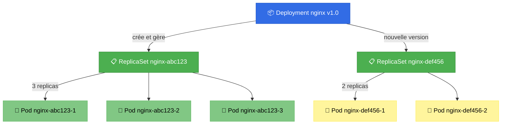
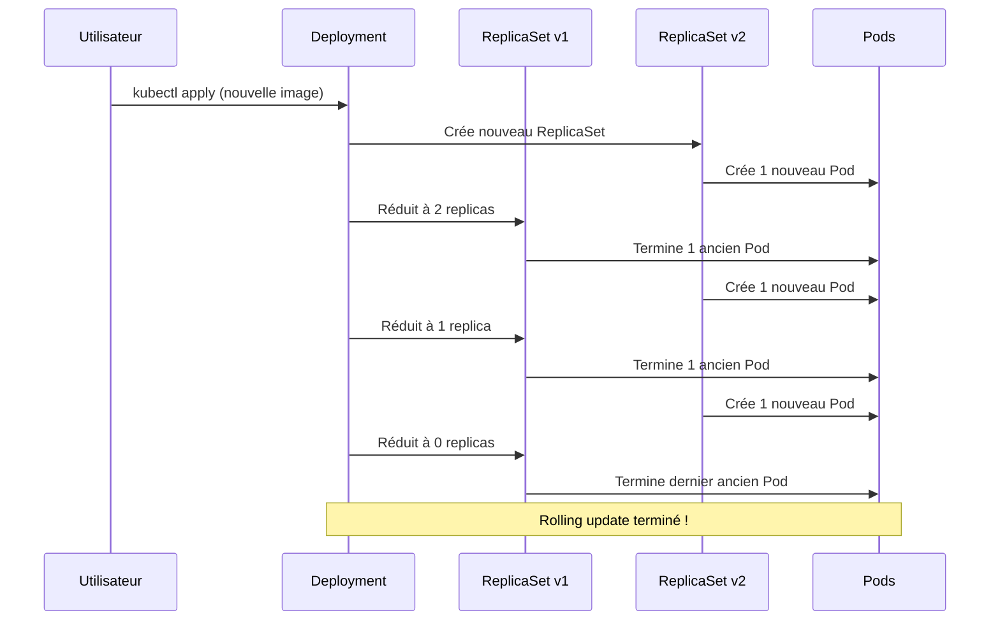
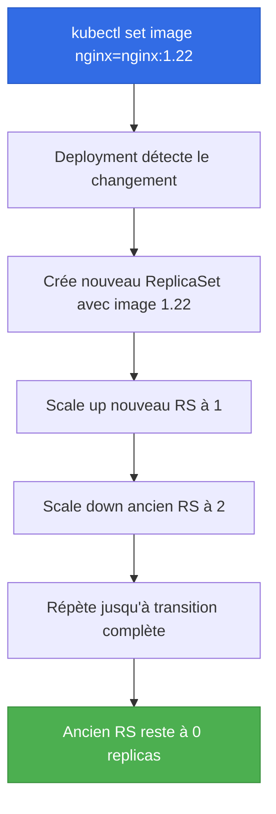
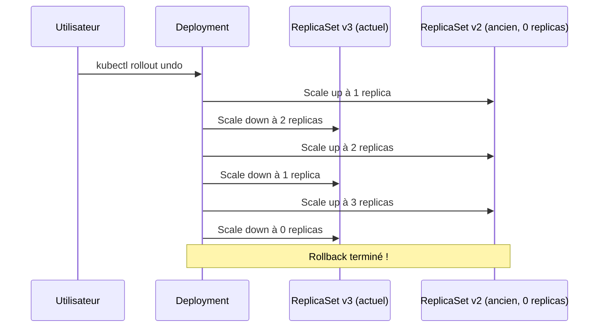

# 🚀 Deployments - Déployer et gérer vos applications

> Le workload le plus utilisé dans Kubernetes

## 📌 Qu'est-ce qu'un Deployment ?

Un **Deployment** est le workload le plus couramment utilisé dans Kubernetes. Il fournit des mises à jour déclaratives pour les Pods et les ReplicaSets.

**En termes simples :**
- Un Deployment **gère automatiquement** les ReplicaSets
- Il permet de **déployer de nouvelles versions** de votre application sans interruption
- Il permet de **revenir en arrière** (rollback) si problème
- Il gère le **scaling** de votre application



## 🎯 Pourquoi utiliser des Deployments plutôt que des ReplicaSets ?

| Aspect | ReplicaSet seul | Deployment |
|--------|----------------|------------|
| **Scaling** | ✅ Oui | ✅ Oui |
| **Auto-healing** | ✅ Oui | ✅ Oui |
| **Rolling updates** | ❌ Manuel | ✅ Automatique |
| **Rollback** | ❌ Impossible | ✅ Facile |
| **Historique versions** | ❌ Non | ✅ Oui |
| **Zero-downtime** | ❌ Non | ✅ Oui |
| **Pause/Resume** | ❌ Non | ✅ Oui |

**Règle d'or : N'utilisez JAMAIS de ReplicaSet directement, utilisez toujours un Deployment !**

## 📝 Structure YAML complète d'un Deployment

```yaml
apiVersion: apps/v1
kind: Deployment
metadata:
  name: nginx-deployment        # Nom du Deployment
  labels:
    app: nginx                  # Labels du Deployment (optionnel)
spec:
  # Nombre de réplicas désirées
  replicas: 3

  # Sélecteur pour trouver les Pods à gérer
  selector:
    matchLabels:
      app: nginx                # Doit correspondre aux labels des Pods

  # Stratégie de déploiement
  strategy:
    type: RollingUpdate         # Ou "Recreate"
    rollingUpdate:
      maxSurge: 1               # Nombre max de Pods en plus pendant l'update
      maxUnavailable: 1         # Nombre max de Pods indisponibles pendant l'update

  # Configuration du nombre de révisions à conserver
  revisionHistoryLimit: 10      # Nombre de ReplicaSets à garder (pour rollback)

  # Template des Pods (identique à ReplicaSet)
  template:
    metadata:
      labels:
        app: nginx              # ✅ Doit correspondre au selector
    spec:
      containers:
      - name: nginx
        image: nginx:1.21       # Version de l'image
        ports:
        - containerPort: 80
        resources:
          requests:
            memory: "64Mi"
            cpu: "100m"
          limits:
            memory: "128Mi"
            cpu: "200m"
```

## 🔄 Relation Deployment → ReplicaSet → Pods

### Hiérarchie

```
Deployment "nginx-deployment"
    ↓ crée et gère
ReplicaSet "nginx-deployment-5d4c8f9b7d" (version actuelle)
    ↓ crée 3 Pods
Pod 1: nginx-deployment-5d4c8f9b7d-abc12
Pod 2: nginx-deployment-5d4c8f9b7d-def34
Pod 3: nginx-deployment-5d4c8f9b7d-ghi56

Après update de l'image → nouveau ReplicaSet:
ReplicaSet "nginx-deployment-7f9c4b6a8e" (nouvelle version)
    ↓ crée progressivement 3 nouveaux Pods
Pod 1: nginx-deployment-7f9c4b6a8e-xyz89
Pod 2: nginx-deployment-7f9c4b6a8e-uvw78
Pod 3: nginx-deployment-7f9c4b6a8e-rst67
```

### Comment ça fonctionne ?



**Le Deployment conserve l'ancien ReplicaSet** (avec 0 replicas) pour permettre un rollback rapide !

## 🛠️ Commande 1 : `kubectl apply`

### Créer un Deployment

```bash
# Méthode 1 : Depuis un fichier YAML
kubectl apply -f deployment.yaml

# Méthode 2 : Depuis une URL
kubectl apply -f https://example.com/deployment.yaml

# Méthode 3 : Depuis stdin
cat <<EOF | kubectl apply -f -
apiVersion: apps/v1
kind: Deployment
metadata:
  name: nginx
spec:
  replicas: 3
  selector:
    matchLabels:
      app: nginx
  template:
    metadata:
      labels:
        app: nginx
    spec:
      containers:
      - name: nginx
        image: nginx:1.21
EOF
```

**Résultat :**
```
deployment.apps/nginx created
```

### Vérifier le Deployment

```bash
# Voir les Deployments
kubectl get deployments
# ou
kubectl get deploy

# Sortie :
NAME    READY   UP-TO-DATE   AVAILABLE   AGE
nginx   3/3     3            3           2m
```

**Explication des colonnes :**
- `READY` : Nombre de Pods prêts / Nombre désiré
- `UP-TO-DATE` : Nombre de Pods avec la dernière version
- `AVAILABLE` : Nombre de Pods disponibles pour les utilisateurs
- `AGE` : Temps depuis la création

### Voir les détails complets

```bash
kubectl describe deployment nginx
```

**Sortie :**
```
Name:                   nginx
Namespace:              default
CreationTimestamp:      Mon, 24 Oct 2025 10:00:00 +0200
Labels:                 app=nginx
Selector:               app=nginx
Replicas:               3 desired | 3 updated | 3 total | 3 available | 0 unavailable
StrategyType:           RollingUpdate
MinReadySeconds:        0
RollingUpdateStrategy:  1 max unavailable, 1 max surge
Pod Template:
  Labels:  app=nginx
  Containers:
   nginx:
    Image:        nginx:1.21
    Port:         80/TCP
    Environment:  <none>
    Mounts:       <none>
  Volumes:        <none>
Conditions:
  Type           Status  Reason
  ----           ------  ------
  Available      True    MinimumReplicasAvailable
  Progressing    True    NewReplicaSetAvailable
OldReplicaSets:  <none>
NewReplicaSet:   nginx-5d4c8f9b7d (3/3 replicas created)
Events:
  Type    Reason             Age   From                   Message
  ----    ------             ----  ----                   -------
  Normal  ScalingReplicaSet  2m    deployment-controller  Scaled up replica set nginx-5d4c8f9b7d to 3
```

### Mettre à jour un Deployment

**Modifier le fichier YAML puis réappliquer :**

```yaml
# deployment.yaml (changement : replicas 3 → 5)
spec:
  replicas: 5  # Changé de 3 à 5
```

```bash
kubectl apply -f deployment.yaml
```

**Résultat :**
```
deployment.apps/nginx configured
```

**⚠️ Important :** `kubectl apply` est **déclaratif** - vous décrivez l'état désiré, Kubernetes fait le nécessaire pour l'atteindre.

### Voir la différence avant d'appliquer

```bash
# Voir ce qui va changer (dry-run)
kubectl apply -f deployment.yaml --dry-run=client

# Voir le diff (nécessite kubectl >= 1.20)
kubectl diff -f deployment.yaml
```

## 🛠️ Commande 2 : `kubectl set image`

### Mettre à jour l'image d'un conteneur

C'est la méthode **impérative** pour changer la version d'une image sans modifier le fichier YAML.

**Syntaxe :**
```bash
kubectl set image deployment/<nom-deployment> <nom-conteneur>=<nouvelle-image>
```

**Exemple 1 : Mise à jour simple**

```bash
# Changer nginx de 1.21 à 1.22
kubectl set image deployment/nginx nginx=nginx:1.22
```

**Résultat :**
```
deployment.apps/nginx image updated
```

**Explication :**
- `deployment/nginx` : le Deployment à modifier
- `nginx=nginx:1.22` : conteneur "nginx" → nouvelle image "nginx:1.22"

**Exemple 2 : Application avec plusieurs conteneurs**

```yaml
# Deployment avec 2 conteneurs
spec:
  template:
    spec:
      containers:
      - name: web
        image: myapp:1.0
      - name: sidecar
        image: logger:1.0
```

```bash
# Mettre à jour uniquement le conteneur "web"
kubectl set image deployment/myapp web=myapp:2.0

# Mettre à jour les deux conteneurs
kubectl set image deployment/myapp web=myapp:2.0 sidecar=logger:2.0
```

**Exemple 3 : Avec enregistrement dans les annotations**

```bash
# Enregistrer la raison du changement (utile pour l'historique)
kubectl set image deployment/nginx nginx=nginx:1.22 --record
```

**⚠️ Note :** L'option `--record` est dépréciée depuis Kubernetes 1.22, mais encore fonctionnelle. Elle ajoute la commande dans les annotations.

**Exemple 4 : Vérifier l'image actuelle**

```bash
# Voir quelle image est utilisée
kubectl get deployment nginx -o jsonpath='{.spec.template.spec.containers[0].image}'
```

**Résultat :**
```
nginx:1.22
```

### Que se passe-t-il après `set image` ?



## 🛠️ Commande 3 : `kubectl rollout status`

### Surveiller la progression d'un déploiement

```bash
kubectl rollout status deployment/nginx
```

**Sortie pendant le rolling update :**
```
Waiting for deployment "nginx" rollout to finish: 1 out of 3 new replicas have been updated...
Waiting for deployment "nginx" rollout to finish: 1 old replicas are pending termination...
Waiting for deployment "nginx" rollout to finish: 2 of 3 updated replicas are available...
deployment "nginx" successfully rolled out
```

**États possibles :**

| État | Signification |
|------|---------------|
| `successfully rolled out` | ✅ Déploiement terminé avec succès |
| `waiting for rollout to finish` | ⏳ En cours de déploiement |
| `has failed progressing` | ❌ Échec du déploiement |

**Exemple avec timeout :**

```bash
# Attendre max 5 minutes
kubectl rollout status deployment/nginx --timeout=5m
```

**Utilisation dans un script CI/CD :**

```bash
#!/bin/bash
kubectl set image deployment/nginx nginx=nginx:1.22
kubectl rollout status deployment/nginx --timeout=10m

if [ $? -eq 0 ]; then
    echo "✅ Déploiement réussi !"
else
    echo "❌ Déploiement échoué - rollback automatique"
    kubectl rollout undo deployment/nginx
    exit 1
fi
```

## 🛠️ Commande 4 : `kubectl rollout history`

### Voir l'historique des déploiements

```bash
kubectl rollout history deployment/nginx
```

**Résultat :**
```
deployment.apps/nginx
REVISION  CHANGE-CAUSE
1         <none>
2         kubectl set image deployment/nginx nginx=nginx:1.22
3         kubectl set image deployment/nginx nginx=nginx:1.23
```

**Explication :**
- `REVISION` : Numéro de version (incrémente à chaque changement)
- `CHANGE-CAUSE` : Raison du changement (si `--record` utilisé)

### Voir les détails d'une révision spécifique

```bash
# Voir les détails de la révision 2
kubectl rollout history deployment/nginx --revision=2
```

**Résultat :**
```
deployment.apps/nginx with revision #2
Pod Template:
  Labels:       app=nginx
  Containers:
   nginx:
    Image:      nginx:1.22
    Port:       80/TCP
    Environment:        <none>
    Mounts:     <none>
  Volumes:      <none>
```

### Comparer deux révisions

```bash
# Voir la révision actuelle (3)
kubectl rollout history deployment/nginx --revision=3

# Comparer avec la révision précédente (2)
kubectl rollout history deployment/nginx --revision=2
```

**Astuce :** Notez les différences (image, variables d'environnement, ressources) pour décider si un rollback est nécessaire.

### Limiter le nombre de révisions conservées

Par défaut, Kubernetes conserve **10 révisions** (contrôlé par `revisionHistoryLimit`).

**Modifier dans le YAML :**
```yaml
spec:
  revisionHistoryLimit: 5  # Garde seulement 5 révisions
```

**Ou via kubectl :**
```bash
kubectl patch deployment nginx -p '{"spec":{"revisionHistoryLimit":5}}'
```

## 🛠️ Commande 5 : `kubectl rollout undo`

### Revenir à la version précédente

```bash
# Rollback à la révision précédente
kubectl rollout undo deployment/nginx
```

**Résultat :**
```
deployment.apps/nginx rolled back
```

**Ce qui se passe :**
1. Kubernetes retrouve l'ancien ReplicaSet (avec 0 replicas)
2. Scale up l'ancien ReplicaSet
3. Scale down le ReplicaSet actuel
4. Fait un rolling update inverse



### Revenir à une révision spécifique

```bash
# Voir l'historique
kubectl rollout history deployment/nginx

# Résultat :
# REVISION  CHANGE-CAUSE
# 1         <none>
# 2         image nginx:1.22
# 3         image nginx:1.23
# 4         image nginx:1.24

# Revenir à la révision 2
kubectl rollout undo deployment/nginx --to-revision=2
```

**Résultat :**
```
deployment.apps/nginx rolled back to revision 2
```

### Exemple complet de rollback

**Scénario : Nouvelle version buggée, retour en arrière**

```bash
# 1. Déployer version 1.23
kubectl set image deployment/nginx nginx=nginx:1.23

# 2. Vérifier le déploiement
kubectl rollout status deployment/nginx

# 3. ❌ Oh non ! L'application crash !
kubectl get pods
# Sortie :
# NAME                     READY   STATUS             RESTARTS   AGE
# nginx-7f9c4b6a8e-abc12   0/1     CrashLoopBackOff   3          2m

# 4. Rollback immédiat !
kubectl rollout undo deployment/nginx

# 5. Vérifier que ça fonctionne
kubectl rollout status deployment/nginx
# Sortie : deployment "nginx" successfully rolled out

kubectl get pods
# Sortie :
# NAME                     READY   STATUS    RESTARTS   AGE
# nginx-5d4c8f9b7d-xyz89   1/1     Running   0          30s
# nginx-5d4c8f9b7d-uvw78   1/1     Running   0          28s
# nginx-5d4c8f9b7d-rst67   1/1     Running   0          26s

# ✅ Application restaurée !
```

## 📊 Stratégies de déploiement

### 1. RollingUpdate (par défaut)

**Remplace progressivement** les anciens Pods par les nouveaux.

```yaml
spec:
  strategy:
    type: RollingUpdate
    rollingUpdate:
      maxSurge: 1         # Nombre max de Pods EN PLUS du nombre désiré
      maxUnavailable: 1   # Nombre max de Pods indisponibles
```

**Paramètres :**

| Paramètre | Valeur | Signification |
|-----------|--------|---------------|
| `maxSurge` | `1` (nombre) | Maximum 1 Pod en plus pendant l'update |
| `maxSurge` | `25%` (pourcentage) | Maximum 25% de Pods en plus |
| `maxUnavailable` | `1` (nombre) | Maximum 1 Pod indisponible |
| `maxUnavailable` | `25%` (pourcentage) | Maximum 25% de Pods indisponibles |

**Exemple avec 4 replicas et maxSurge=1, maxUnavailable=1 :**

```
État initial : 4 Pods v1

Étape 1 : Crée 1 nouveau Pod v2 (maxSurge=1)
[v1] [v1] [v1] [v1] [v2]  → 5 Pods total

Étape 2 : Termine 1 Pod v1 (maxUnavailable=1)
[v1] [v1] [v1] [v2]  → 4 Pods total

Étape 3 : Crée 1 nouveau Pod v2
[v1] [v1] [v1] [v2] [v2]  → 5 Pods total

Étape 4 : Termine 1 Pod v1
[v1] [v1] [v2] [v2]  → 4 Pods total

... continue jusqu'à avoir 4 Pods v2
```

**Avantages :**
- ✅ Zero-downtime (pas d'interruption de service)
- ✅ Rollback facile si problème détecté
- ✅ Par défaut et recommandé

**Inconvénients :**
- ⚠️ Plus lent (déploiement progressif)
- ⚠️ Période où v1 et v2 coexistent

### 2. Recreate

**Termine TOUS les anciens Pods avant de créer les nouveaux.**

```yaml
spec:
  strategy:
    type: Recreate
```

**Ce qui se passe :**

```
État initial : 4 Pods v1
[v1] [v1] [v1] [v1]

Étape 1 : Termine TOUS les Pods v1
[ ] [ ] [ ] [ ]  → 0 Pods (downtime !)

Étape 2 : Crée tous les Pods v2
[v2] [v2] [v2] [v2]  → 4 Pods v2
```

**Avantages :**
- ✅ Simple et rapide
- ✅ Pas de coexistence v1/v2
- ✅ Utile si incompatibilité entre versions

**Inconvénients :**
- ❌ **Downtime** (interruption de service)
- ❌ Pas de rollback progressif

**Quand utiliser Recreate ?**
- Base de données qui ne supporte pas plusieurs versions en parallèle
- Migration de schéma incompatible
- Application qui ne peut pas avoir 2 versions simultanées

## 🎯 Workflow complet : Déployer une nouvelle version

### Scénario : Application web de v1.0 à v2.0

**Étape 1 : État initial**

```bash
# Créer le déploiement v1.0
cat <<EOF | kubectl apply -f -
apiVersion: apps/v1
kind: Deployment
metadata:
  name: webapp
spec:
  replicas: 5
  selector:
    matchLabels:
      app: webapp
  template:
    metadata:
      labels:
        app: webapp
        version: "1.0"
    spec:
      containers:
      - name: webapp
        image: myapp:1.0
        ports:
        - containerPort: 8080
EOF
```

**Vérifier :**
```bash
kubectl get pods -l app=webapp
```

**Sortie :**
```
NAME                      READY   STATUS    RESTARTS   AGE
webapp-5d4c8f9b7d-abc12   1/1     Running   0          2m
webapp-5d4c8f9b7d-def34   1/1     Running   0          2m
webapp-5d4c8f9b7d-ghi56   1/1     Running   0          2m
webapp-5d4c8f9b7d-jkl78   1/1     Running   0          2m
webapp-5d4c8f9b7d-mno90   1/1     Running   0          2m
```

**Étape 2 : Déployer v2.0**

```bash
# Méthode 1 : kubectl set image
kubectl set image deployment/webapp webapp=myapp:2.0

# Méthode 2 : kubectl apply (modifier le YAML puis)
kubectl apply -f deployment.yaml
```

**Étape 3 : Surveiller le déploiement**

```bash
# Terminal 1 : Surveiller le status
kubectl rollout status deployment/webapp

# Terminal 2 : Observer les Pods en temps réel
kubectl get pods -l app=webapp -w
```

**Sortie du terminal 2 (temps réel) :**
```
NAME                      READY   STATUS    RESTARTS   AGE
webapp-5d4c8f9b7d-abc12   1/1     Running   0          5m
webapp-5d4c8f9b7d-def34   1/1     Running   0          5m
webapp-5d4c8f9b7d-ghi56   1/1     Running   0          5m
webapp-5d4c8f9b7d-jkl78   1/1     Running   0          5m
webapp-5d4c8f9b7d-mno90   1/1     Running   0          5m
webapp-7f9c4b6a8e-xyz89   0/1     Pending   0          0s    ← Nouveau Pod créé
webapp-7f9c4b6a8e-xyz89   0/1     ContainerCreating   0          1s
webapp-7f9c4b6a8e-xyz89   1/1     Running   0          5s    ← Prêt !
webapp-5d4c8f9b7d-abc12   1/1     Terminating   0          5m    ← Ancien Pod terminé
webapp-7f9c4b6a8e-uvw78   0/1     Pending   0          0s
webapp-7f9c4b6a8e-uvw78   0/1     ContainerCreating   0          1s
...
```

**Étape 4 : Vérifier le résultat**

```bash
# Voir les Deployments
kubectl get deployment webapp
```

**Sortie :**
```
NAME     READY   UP-TO-DATE   AVAILABLE   AGE
webapp   5/5     5            5           10m
```

```bash
# Voir les ReplicaSets (2 versions)
kubectl get replicasets -l app=webapp
```

**Sortie :**
```
NAME                DESIRED   CURRENT   READY   AGE
webapp-5d4c8f9b7d   0         0         0       10m   ← Ancienne version (v1.0)
webapp-7f9c4b6a8e   5         5         5       2m    ← Nouvelle version (v2.0)
```

```bash
# Voir l'historique
kubectl rollout history deployment/webapp
```

**Sortie :**
```
deployment.apps/webapp
REVISION  CHANGE-CAUSE
1         <none>
2         kubectl set image deployment/webapp webapp=myapp:2.0
```

**Étape 5 : En cas de problème → Rollback !**

```bash
# Si la v2.0 a un bug
kubectl rollout undo deployment/webapp

# Vérifier
kubectl rollout status deployment/webapp
```

## ⚠️ Erreurs courantes et solutions

### Erreur 1 : Le déploiement ne progresse pas

**Symptôme :**
```bash
kubectl rollout status deployment/nginx
# Sortie : Waiting for deployment "nginx" rollout to finish: 0 out of 3 new replicas have been updated...
# (bloqué à l'infini)
```

**Causes possibles :**

1. **Image introuvable**
```bash
kubectl describe pod nginx-xxx
# Sortie : Failed to pull image "nginx:999": rpc error: code = NotFound
```

**Solution :** Corriger le nom/tag de l'image
```bash
kubectl set image deployment/nginx nginx=nginx:1.22
```

2. **Ressources insuffisantes**
```bash
kubectl describe pod nginx-xxx
# Sortie : 0/3 nodes are available: insufficient memory
```

**Solution :** Réduire les resource requests ou ajouter des nodes

3. **ImagePullBackOff**
```bash
kubectl get pods
# Sortie : nginx-xxx   0/1     ImagePullBackOff   0          2m
```

**Solution :** Vérifier l'accès au registry
```bash
# Créer un secret pour registry privé
kubectl create secret docker-registry regcred \
  --docker-server=registry.example.com \
  --docker-username=user \
  --docker-password=pass

# Utiliser dans le Deployment
spec:
  template:
    spec:
      imagePullSecrets:
      - name: regcred
```

### Erreur 2 : Pods en CrashLoopBackOff après déploiement

**Symptôme :**
```bash
kubectl get pods
# Sortie : nginx-xxx   0/1     CrashLoopBackOff   5          5m
```

**Solution :** Rollback immédiat + investigation
```bash
# 1. Rollback
kubectl rollout undo deployment/nginx

# 2. Voir les logs de la version buggée
kubectl logs deployment/nginx --previous

# 3. Corriger le problème puis re-déployer
```

### Erreur 3 : Labels ne correspondent pas

**Symptôme :**
```yaml
spec:
  selector:
    matchLabels:
      app: nginx
  template:
    metadata:
      labels:
        app: web  # ❌ Ne correspond pas !
```

**Erreur :**
```
error: error validating "deployment.yaml": error validating data:
ValidationError(Deployment.spec.template.metadata.labels):
invalid value: map[string]string{"app":"web"}:
must match label selector: app=nginx
```

**Solution :** Les labels doivent correspondre exactement
```yaml
spec:
  selector:
    matchLabels:
      app: nginx
  template:
    metadata:
      labels:
        app: nginx  # ✅ Correct
```

## 📋 Commandes utiles récapitulatives

```bash
# ============================================
# CRÉER / APPLIQUER
# ============================================
kubectl apply -f deployment.yaml            # Créer ou mettre à jour
kubectl create deployment nginx --image=nginx:1.21  # Création impérative

# ============================================
# VOIR L'ÉTAT
# ============================================
kubectl get deployments                     # Liste des Deployments
kubectl get deploy nginx                    # Un Deployment spécifique
kubectl describe deployment nginx           # Détails complets
kubectl get replicasets -l app=nginx       # ReplicaSets associés
kubectl get pods -l app=nginx              # Pods associés

# ============================================
# METTRE À JOUR
# ============================================
kubectl set image deployment/nginx nginx=nginx:1.22  # Changer image
kubectl scale deployment nginx --replicas=5          # Changer replicas
kubectl apply -f deployment.yaml                     # Appliquer changements YAML

# ============================================
# ROLLING UPDATE
# ============================================
kubectl rollout status deployment/nginx            # Surveiller progression
kubectl rollout history deployment/nginx           # Voir historique
kubectl rollout history deployment/nginx --revision=2  # Détails révision
kubectl rollout pause deployment/nginx             # Pause rollout
kubectl rollout resume deployment/nginx            # Reprendre rollout

# ============================================
# ROLLBACK
# ============================================
kubectl rollout undo deployment/nginx              # Revenir version précédente
kubectl rollout undo deployment/nginx --to-revision=2  # Revenir à révision 2

# ============================================
# SUPPRIMER
# ============================================
kubectl delete deployment nginx                    # Supprimer (+ RS + Pods)
kubectl delete -f deployment.yaml                  # Supprimer depuis fichier
```

## 🎓 Exercice pratique

### Objectif : Déployer une application, la mettre à jour, et gérer un rollback

**Étape 1 : Créer un Deployment nginx v1.21**

```bash
kubectl create deployment nginx --image=nginx:1.21 --replicas=3
```

**Étape 2 : Vérifier le déploiement**

```bash
kubectl get deployment nginx
kubectl get pods -l app=nginx
```

**Étape 3 : Mettre à jour vers nginx:1.22**

```bash
kubectl set image deployment/nginx nginx=nginx:1.22
```

**Étape 4 : Observer le rolling update**

```bash
# Terminal 1
kubectl rollout status deployment/nginx

# Terminal 2
kubectl get pods -l app=nginx -w
```

**Étape 5 : Voir l'historique**

```bash
kubectl rollout history deployment/nginx
```

**Étape 6 : Mettre à jour vers une version buggée (nginx:badversion)**

```bash
kubectl set image deployment/nginx nginx=nginx:badversion
kubectl get pods -l app=nginx
# Vous devriez voir ImagePullBackOff
```

**Étape 7 : Rollback !**

```bash
kubectl rollout undo deployment/nginx
kubectl rollout status deployment/nginx
```

**Étape 8 : Vérifier que tout fonctionne**

```bash
kubectl get pods -l app=nginx
# Tous les Pods doivent être Running
```

**Étape 9 : Nettoyer**

```bash
kubectl delete deployment nginx
```

## 🔗 Liens vers les autres sections

- ← Précédent : [[02-ReplicaSet-YAML-Detaille|Structure YAML ReplicaSet détaillée]]
- → Suivant : [[04-StatefulSets|StatefulSets pour applications stateful]]
- 📖 Index : [[00-INDEX|Vue d'ensemble des Workloads]]

## 📚 Ressources

- [Documentation Kubernetes - Deployments](https://kubernetes.io/docs/concepts/workloads/controllers/deployment/)
- [Rolling Update Strategy](https://kubernetes.io/docs/tutorials/kubernetes-basics/update/update-intro/)
- [KodeKloud - Deployments](https://kodekloud.com/courses/kubernetes-for-the-absolute-beginners/)

---

**⭐⭐ Section essentielle pour maîtriser Kubernetes ! Les Deployments sont utilisés dans 90% des cas.**
