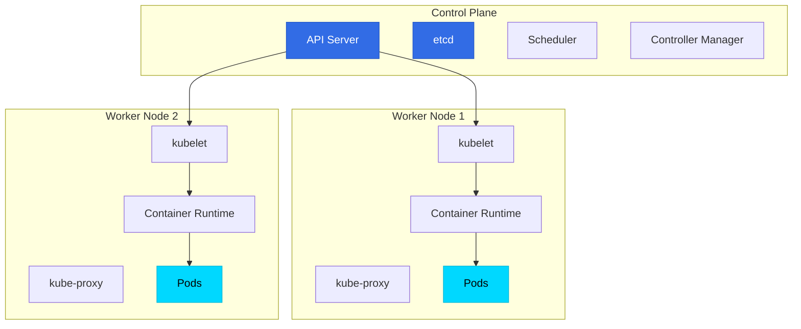

# ☸️ Kubernetes - Table des matières

> Maîtriser l'orchestration de conteneurs

## 📑 Chapitres

### [[01-Introduction/00-INDEX|01 - Introduction]]
- Qu'est-ce que Kubernetes ?
- Pourquoi l'orchestration ?
- Architecture de Kubernetes
- Concepts clés

### [[02-Kubernetes-Overview/00-INDEX|02 - Kubernetes Overview]]
- Composants du Control Plane
- Worker Nodes
- kubectl et API Server
- Cluster architecture

### [[03-Kubernetes-Concepts/00-INDEX|03 - Kubernetes Concepts]]
- Pods
- ReplicaSets
- Deployments
- Services
- Namespaces
- Labels et Selectors

### [[04-YAML-Introduction/00-INDEX|04 - YAML Introduction]]
- Syntaxe YAML de base
- Structure d'un manifest Kubernetes
- Clés importantes
- Exemples pratiques

### [[05-Pods-ReplicaSets-Deployments/00-INDEX|05 - Pods, ReplicaSets & Deployments]]
- Lifecycle d'un Pod
- Gestion avec ReplicaSets
- Stratégies de déploiement
- Rolling updates et rollbacks

### [[06-Networking/00-INDEX|06 - Networking]]
- Modèle réseau Kubernetes
- CNI (Container Network Interface)
- Communication Pod-to-Pod
- DNS dans Kubernetes

### [[07-Services/00-INDEX|07 - Services]]
- Types de Services (ClusterIP, NodePort, LoadBalancer)
- Endpoints
- Ingress
- Service Discovery

### [[08-Microservices-Architecture/00-INDEX|08 - Microservices Architecture]]
- Design patterns
- Communication inter-services
- Service mesh
- Observabilité

### [[09-Kubernetes-on-Cloud/00-INDEX|09 - Kubernetes on Cloud]]
- Managed Kubernetes (EKS, GKE, AKS)
- Cloud provider integration
- Storage classes
- Load balancers cloud

## 🎯 Objectifs d'apprentissage

À la fin de ce module, vous serez capable de :

✅ Comprendre l'architecture de Kubernetes
✅ Déployer et gérer des applications conteneurisées
✅ Configurer le réseau et les services
✅ Utiliser YAML pour définir des ressources
✅ Implémenter des architectures microservices
✅ Déployer sur des plateformes cloud

## 🗺️ Architecture simplifiée

## 🔗 Ressources

- [Documentation officielle Kubernetes](https://kubernetes.io/docs/)
- [KodeKloud - Kubernetes Course](https://kodekloud.com/courses/kubernetes-for-the-absolute-beginners/)
- [Kubernetes Playground](https://labs.play-with-k8s.com/)
- [CNCF Landscape](https://landscape.cncf.io/)

## 📝 Notes

Cette section suit le cours Kubernetes de KodeKloud et inclut des exemples pratiques.

---

**Commencer par [[01-Introduction/01-Qu-est-ce-que-Kubernetes|Qu'est-ce que Kubernetes ?]] →**
