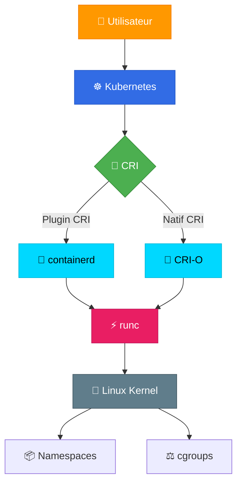

# ⚙️ Runtimes et CRI

> Comprendre l'écosystème complet des container runtimes

## 📌 Contexte

Cette section explique en détail **comment fonctionnent les runtimes de conteneurs** et **comment Kubernetes communique avec eux via l'interface CRI**.

C'est la partie technique qui répond aux questions :
- Qu'est-ce que containerd ?
- Comment CRI-O diffère de containerd ?
- Qu'est-ce que runc et pourquoi est-il important ?
- Comment Kubernetes utilise CRI pour dialoguer avec les runtimes ?
- Pourquoi Docker a été "déprécié" dans Kubernetes ?

## 📑 Chapitres

### [[01-Comprendre-les-Runtimes/00-INDEX|01 - Comprendre les Runtimes]]
- Qu'est-ce qu'un runtime de conteneur ?
- High-level vs Low-level runtimes
- Pourquoi plusieurs runtimes existent ?
- L'écosystème en 2025

### [[02-containerd/00-INDEX|02 - containerd]]
- Présentation de containerd
- Architecture et composants
- Relation avec Docker
- Utilisation avec Kubernetes
- Commandes `ctr` et `nerdctl`

### [[03-CRI-O/00-INDEX|03 - CRI-O]]
- Qu'est-ce que CRI-O ?
- Design léger pour Kubernetes
- Comparaison avec containerd
- Quand utiliser CRI-O ?

### [[04-runc-OCI/00-INDEX|04 - runc et OCI]]
- Spécification OCI (Open Container Initiative)
- runc : implémentation de référence
- Alternatives : crun, kata-containers, gVisor
- Comment runc crée un conteneur

### [[05-Interface-CRI/00-INDEX|05 - CRI - Container Runtime Interface]]
- Définition de CRI
- Pourquoi Kubernetes a créé CRI
- Architecture de CRI (RuntimeService, ImageService)
- API gRPC
- Plugins CRI
- crictl (CLI pour CRI)

### [[06-Docker-et-containerd/00-INDEX|06 - Docker et containerd]]
- Docker utilise containerd
- Déprécation de dockershim
- Migration de Docker vers containerd/CRI-O
- Différences pratiques

## 🎯 Objectifs

À la fin de ce module, vous comprendrez :

✅ La différence entre high-level et low-level runtimes
✅ Comment containerd et CRI-O s'intègrent avec Kubernetes
✅ Le rôle de runc et la spécification OCI
✅ Ce qu'est l'interface CRI et comment elle fonctionne
✅ L'architecture complète de l'écosystème des conteneurs
✅ Pourquoi Docker a été déprécié dans Kubernetes (et pourquoi ce n'est pas grave)

## 🏗️ Architecture complète



## 📊 Comparaison des runtimes

| Runtime | Type | Utilisé par | CRI | Taille |
|---------|------|-------------|-----|--------|
| **containerd** | High-level | Docker, K8s | Via plugin | ~200 MB |
| **CRI-O** | High-level | K8s only | Natif | ~50 MB |
| **Docker Engine** | High-level | Docker CLI | Non (était dockershim) | ~500 MB |
| **runc** | Low-level | containerd, CRI-O | N/A | ~10 MB |
| **crun** | Low-level | Alternative runc | N/A | ~5 MB |

## 🔍 Concepts clés couverts

### CRI (Container Runtime Interface)
```
Kubernetes ne parle PAS directement à containerd ou CRI-O.
Kubernetes utilise l'interface CRI (standardisée) pour communiquer.

Kubernetes → CRI → containerd → runc → Linux Kernel
```

### Exemple concret
```bash
# Vous lancez un Pod
kubectl run nginx --image=nginx

# Kubernetes (via kubelet) appelle CRI
kubelet → CRI gRPC call → containerd

# containerd gère l'image et appelle runc
containerd → pull image → create container spec → runc

# runc crée le conteneur
runc → Linux namespaces + cgroups → conteneur running
```

## 🔗 Lien avec les autres sections

- **Avant** : [[01-Kubernetes-Core/02-Architecture/00-INDEX|Architecture Kubernetes]] - Comprendre kubelet
- **Fondamentaux** : [[00-Rappels-Docker/00-INDEX|Rappels Docker]] - Comprendre les conteneurs
- **Pratique** : Utilisez `crictl`, `ctr`, `nerdctl` pour explorer

## 📚 Ressources

- [containerd.io](https://containerd.io/)
- [CRI-O](https://cri-o.io/)
- [OCI Runtime Specification](https://github.com/opencontainers/runtime-spec)
- [Kubernetes CRI Documentation](https://kubernetes.io/docs/concepts/architecture/cri/)
- [runc GitHub](https://github.com/opencontainers/runc)

---

**Commencer → [[01-Comprendre-les-Runtimes/01-High-level-vs-Low-level|High-level vs Low-level Runtimes]]**
