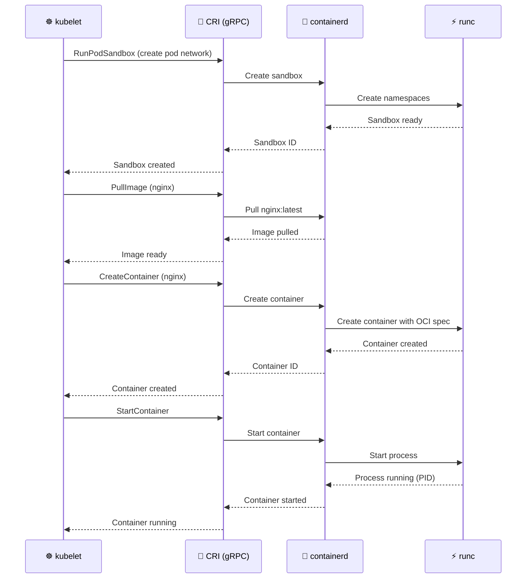

# 🔌 CRI - Container Runtime Interface

> L'interface standardisée entre Kubernetes et les runtimes

## 📌 Contexte

**CRI (Container Runtime Interface)** est l'interface qui permet à Kubernetes de communiquer avec n'importe quel runtime de conteneurs de manière standardisée.

## Contenu du chapitre

### [[01-Quest-ce-que-CRI|📖 Qu'est-ce que CRI ?]]
- Définition de CRI
- Pourquoi Kubernetes a créé CRI
- Historique (dockershim → CRI)
- Spécification CRI

### [[02-Architecture-CRI|🏗️ Architecture CRI]]
- API gRPC
- RuntimeService (gestion conteneurs)
- ImageService (gestion images)
- Protocol Buffers

### [[03-Flow-Creation-Pod|🔄 Flow de création d'un Pod]]
- Étape par étape : `kubectl run` → Pod running
- Rôle de kubelet
- Appels CRI
- Interaction avec containerd/CRI-O

### [[04-RuntimeService|⚙️ RuntimeService]]
- RunPodSandbox
- CreateContainer
- StartContainer
- StopContainer
- RemoveContainer
- ListContainers
- ContainerStatus

### [[05-ImageService|🖼️ ImageService]]
- PullImage
- ListImages
- RemoveImage
- ImageStatus

### [[06-crictl|🔧 crictl - CLI pour CRI]]
- Installation de crictl
- Commandes de base
- Debugging avec crictl
- Comparaison avec docker CLI

### [[07-Plugins-CRI|🔌 Plugins CRI]]
- containerd CRI plugin
- CRI-O (implémentation native)
- Autres implémentations

## 🎯 Objectifs

À la fin de ce chapitre, vous comprendrez :
- ✅ Ce qu'est CRI et pourquoi il existe
- ✅ Comment Kubernetes utilise CRI pour parler aux runtimes
- ✅ Les deux services principaux : RuntimeService et ImageService
- ✅ Comment utiliser crictl pour débugger
- ✅ La différence entre les implémentations CRI

## 🗺️ Kubernetes communique via CRI

**Point clé :** Toute la communication passe par l'API gRPC de CRI !

---

**Commencer → [[01-Quest-ce-que-CRI|Qu'est-ce que CRI ?]]**
