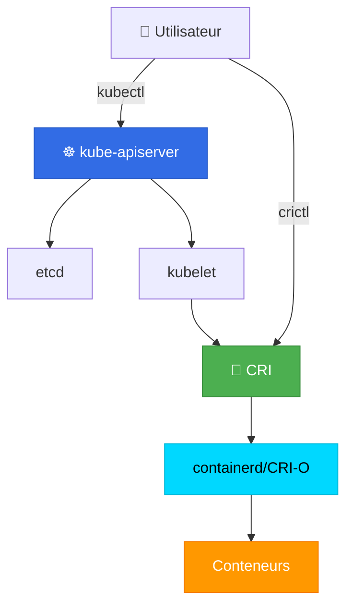

# 🔄 crictl vs kubectl - Comprendre la différence

> Deux outils, deux niveaux d'abstraction

## ❓ La confusion

Vous avez probablement déjà tapé ces commandes :
```bash
kubectl get pods
crictl pods
```

**Les deux montrent des Pods... alors quelle est la différence ?** 🤔

---

## 🎯 La différence en une phrase

| Outil | Niveau | Cible |
|-------|--------|-------|
| **kubectl** | **Haut niveau** (orchestration) | Parle à **l'API Kubernetes** |
| **crictl** | **Bas niveau** (runtime) | Parle au **runtime CRI** (containerd/CRI-O) |

### Analogie

Imaginez une entreprise :

```
PDG (kubectl)
    ↓ donne des ordres
Chef d'équipe (API Kubernetes)
    ↓ délègue le travail
Employé (kubelet)
    ↓ exécute les tâches
Outil (crictl)
    ↓ inspecte directement le travail fait
Machine (container runtime)
```

- **kubectl** = Vous êtes le **PDG**, vous donnez des ordres stratégiques
- **crictl** = Vous allez voir **directement à l'usine** ce qui se passe

---

## 🏗️ Architecture : Où se situe chaque outil



**Points clés :**
- `kubectl` passe par **l'API Server** → vision globale du cluster
- `crictl` va **directement au runtime** → vision locale du Node

---

## 📊 Différences fondamentales

| Aspect | kubectl | crictl |
|--------|---------|--------|
| **Niveau** | Orchestration (Kubernetes) | Runtime (CRI) |
| **Portée** | Tout le cluster | Un seul Node (local) |
| **Communique avec** | kube-apiserver (API REST) | Container runtime (gRPC CRI) |
| **Connaît** | Deployments, Services, ConfigMaps, etc. | Seulement Pods et Conteneurs |
| **Utilisation** | Gestion d'applications | Debug runtime |
| **Nécessite** | Accès au cluster (kubeconfig) | Accès direct au Node |
| **Vue** | État désiré (what) | État réel (how) |

---

## 💻 Exemples de commandes côte à côte

### 1. Lister les Pods

#### Avec kubectl
```bash
kubectl get pods
```

**Résultat :**
```
NAME                     READY   STATUS    RESTARTS   AGE
nginx-7c5ddbdf54-abc12   1/1     Running   0          10m
redis-6d5f5bf5c-def34    1/1     Running   0          5m
```

**Ce que vous voyez :**
- Nom du **Deployment** ou **ReplicaSet** (nginx-7c5ddbdf54)
- Statut Kubernetes (Running, Pending, etc.)
- Nombre de restarts
- Âge du Pod

#### Avec crictl
```bash
crictl pods
```

**Résultat :**
```
POD ID              CREATED             STATE   NAME                         NAMESPACE
a1b2c3d4e5f6        10 minutes ago      Ready   nginx-7c5ddbdf54-abc12       default
g7h8i9j0k1l2        5 minutes ago       Ready   redis-6d5f5bf5c-def34        default
```

**Ce que vous voyez :**
- POD ID (identifiant runtime)
- État runtime (Ready, NotReady)
- Pas d'info sur Deployments ou Services

**Différence clé :** kubectl montre la **vue Kubernetes**, crictl montre la **vue runtime**.

---

### 2. Lister les conteneurs

#### Avec kubectl
```bash
kubectl get pods -o wide
```

**Résultat :**
```
NAME                     READY   STATUS    IP           NODE
nginx-7c5ddbdf54-abc12   1/1     Running   10.244.1.5   worker-1
```

**Limites :** kubectl montre les Pods, **pas les conteneurs individuels** directement.

Pour voir les conteneurs, il faut :
```bash
kubectl describe pod nginx-7c5ddbdf54-abc12
```

#### Avec crictl
```bash
crictl ps
```

**Résultat :**
```
CONTAINER ID     IMAGE              CREATED          STATE    NAME     POD ID
mno345pqr678     nginx:latest       10 minutes ago   Running  nginx    a1b2c3d4e5f6
```

**Avantage :** crictl montre **directement les conteneurs** (comme `docker ps`).

---

### 3. Voir les logs

#### Avec kubectl
```bash
kubectl logs nginx-7c5ddbdf54-abc12
```

**Ce qui se passe :**
1. kubectl demande à l'API Server
2. API Server demande au kubelet sur le Node
3. kubelet lit les logs via le runtime
4. Les logs remontent jusqu'à vous

**Avantage :** Marche depuis **n'importe où** (pas besoin d'être sur le Node).

#### Avec crictl
```bash
crictl logs mno345pqr678
```

**Ce qui se passe :**
1. crictl lit **directement** les logs du runtime
2. Pas de passage par l'API

**Avantage :** Plus rapide, fonctionne même si l'API est down.

**Inconvénient :** Nécessite d'être **sur le Node** (SSH).

---

### 4. Exécuter une commande dans un conteneur

#### Avec kubectl
```bash
kubectl exec -it nginx-7c5ddbdf54-abc12 -- bash
```

**Utilise :** Le nom du **Pod** (niveau Kubernetes).

#### Avec crictl
```bash
crictl exec -it mno345pqr678 sh
```

**Utilise :** L'ID du **conteneur** (niveau runtime).

**Différence :** kubectl utilise les noms Kubernetes, crictl utilise les IDs runtime.

---

### 5. Inspecter un objet

#### Avec kubectl
```bash
kubectl describe pod nginx-7c5ddbdf54-abc12
```

**Résultat :** Informations **Kubernetes** (Events, Conditions, Volumes, etc.)

```yaml
Name:         nginx-7c5ddbdf54-abc12
Namespace:    default
Node:         worker-1/192.168.1.10
Labels:       app=nginx
Annotations:  ...
Status:       Running
IP:           10.244.1.5
Controlled By:  ReplicaSet/nginx-7c5ddbdf54
Containers:
  nginx:
    Image:          nginx:latest
    Port:           80/TCP
    State:          Running
    Ready:          True
Events:
  Normal  Scheduled  10m   Successfully assigned default/nginx to worker-1
  Normal  Pulled     10m   Container image "nginx:latest" already present
  Normal  Created    10m   Created container nginx
  Normal  Started    10m   Started container nginx
```

#### Avec crictl
```bash
crictl inspect mno345pqr678
```

**Résultat :** Informations **runtime** (JSON OCI spec, namespaces, cgroups, etc.)

```json
{
  "status": {
    "id": "mno345pqr678",
    "metadata": {
      "name": "nginx"
    },
    "state": "CONTAINER_RUNNING",
    "createdAt": "2024-01-15T10:00:00Z",
    "startedAt": "2024-01-15T10:00:01Z",
    "image": {
      "image": "docker.io/library/nginx:latest"
    },
    "imageRef": "sha256:abc123...",
    "mounts": [
      {
        "containerPath": "/var/run/secrets/kubernetes.io/serviceaccount",
        "hostPath": "/var/lib/kubelet/pods/xyz/volumes/..."
      }
    ],
    "labels": {
      "io.kubernetes.pod.name": "nginx-7c5ddbdf54-abc12",
      "io.kubernetes.pod.namespace": "default"
    }
  },
  "info": {
    "sandboxID": "a1b2c3d4e5f6",
    "pid": 12345,
    "runtimeSpec": {...}
  }
}
```

**Différence :** kubectl donne la **vue applicative**, crictl donne la **vue système**.

---

### 6. Supprimer

#### Avec kubectl
```bash
kubectl delete pod nginx-7c5ddbdf54-abc12
```

**Ce qui se passe :**
1. Kubernetes marque le Pod pour suppression
2. Termine gracieusement (SIGTERM puis SIGKILL après 30s)
3. **Kubernetes peut recréer le Pod** si c'est un Deployment !

**Exemple :**
```bash
kubectl delete pod nginx-7c5ddbdf54-abc12
# pod "nginx-7c5ddbdf54-abc12" deleted

kubectl get pods
# NAME                     READY   STATUS    AGE
# nginx-7c5ddbdf54-ghi78   1/1     Running   3s    ← Nouveau Pod créé !
```

#### Avec crictl
```bash
crictl stopp a1b2c3d4e5f6  # Stop le pod sandbox
crictl rmp a1b2c3d4e5f6    # Remove le pod sandbox
```

**Ce qui se passe :**
1. Arrêt direct du conteneur au niveau runtime
2. **Kubernetes va détecter** que le Pod a disparu
3. **Kubernetes va le recréer** (si Deployment)

**⚠️ Attention :** Supprimer avec crictl est **dangereux** car :
- Vous contournez Kubernetes
- Kubernetes ne sait pas pourquoi le Pod a disparu
- Peut causer des incohérences

**Règle :** **Toujours utiliser kubectl pour supprimer**, sauf debug extrême.

---

## 🎯 Quand utiliser quel outil ?

### Utilisez kubectl pour :

✅ **Gestion quotidienne** des applications
✅ **Déployer** (apply, create, delete)
✅ **Voir l'état global** du cluster
✅ **Scaler** des Deployments
✅ **Gérer** des Services, ConfigMaps, Secrets
✅ **Voir les Events** Kubernetes
✅ **Travailler depuis votre laptop** (remote)

**Exemples :**
```bash
kubectl apply -f deployment.yaml
kubectl get deployments
kubectl scale deployment nginx --replicas=5
kubectl expose deployment nginx --port=80
kubectl get events
```

### Utilisez crictl pour :

✅ **Déboguer** des problèmes de runtime
✅ **Voir** ce que fait réellement le runtime
✅ **Vérifier** si les conteneurs sont créés
✅ **Diagnostiquer** pourquoi kubelet ne peut pas créer un Pod
✅ **Inspecter** les images présentes sur le Node
✅ **Quand kubectl ne fonctionne pas** (API down)

**Exemples :**
```bash
# Sur le Node (SSH)
crictl ps -a    # Tous les conteneurs (même stopped)
crictl images   # Images disponibles localement
crictl pull nginx:latest  # Tester le pull d'image
crictl stats    # Utilisation ressources des conteneurs
```

---

## 🔍 Scénarios concrets

### Scénario 1 : Déployer une application

**Objectif :** Déployer nginx avec 3 replicas

**Outil :** `kubectl` ✅

```bash
# Créer le Deployment
kubectl create deployment nginx --image=nginx --replicas=3

# Vérifier
kubectl get deployments
kubectl get pods

# Exposer
kubectl expose deployment nginx --port=80 --type=NodePort

# Scaler
kubectl scale deployment nginx --replicas=5
```

**Pourquoi pas crictl ?** crictl ne connaît pas les Deployments, Services, etc.

---

### Scénario 2 : Pod en status CrashLoopBackOff

**Objectif :** Comprendre pourquoi le Pod redémarre sans cesse

**Étape 1 - kubectl :**
```bash
kubectl get pods
# NAME                    READY   STATUS             RESTARTS
# myapp-abc123            0/1     CrashLoopBackOff   5

kubectl describe pod myapp-abc123
# Events:
#   Back-off restarting failed container
```

**Étape 2 - Voir les logs (kubectl) :**
```bash
kubectl logs myapp-abc123
# Error: Cannot connect to database
```

**Étape 3 - Si besoin, crictl (sur le Node) :**
```bash
# SSH sur le Node
ssh worker-1

# Voir les conteneurs (même stopped)
crictl ps -a
# CONTAINER ID     STATE     NAME     POD ID
# xyz789           Exited    myapp    abc123

# Logs du conteneur arrêté
crictl logs xyz789

# Inspecter le conteneur
crictl inspect xyz789
```

**Pourquoi crictl ici ?** Pour voir les **conteneurs arrêtés** et déboguer au niveau runtime.

---

### Scénario 3 : Image ne se pull pas

**Objectif :** Comprendre pourquoi l'image ne se télécharge pas

**kubectl (global) :**
```bash
kubectl describe pod myapp-abc123
# Events:
#   Failed to pull image "myregistry.com/myapp:1.0":
#   rpc error: code = Unknown desc = failed to pull and unpack image
```

**crictl (sur le Node) :**
```bash
# SSH sur le Node
ssh worker-1

# Tester le pull manuellement
crictl pull myregistry.com/myapp:1.0
# Error: authentication required

# Ah ! Problème d'authentification
# Vérifier les credentials
crictl images | grep myapp

# Tester avec une autre image
crictl pull nginx
# Downloaded
```

**Pourquoi crictl ici ?** Pour **tester directement** le pull au niveau runtime.

---

### Scénario 4 : API Kubernetes down

**Problème :** L'API Server ne répond pas, kubectl ne fonctionne pas

```bash
kubectl get pods
# Error: Unable to connect to the server
```

**Solution : crictl sur les Nodes**
```bash
# SSH sur chaque Node
ssh worker-1

# Voir ce qui tourne
crictl pods
crictl ps

# Les conteneurs tournent toujours !
# Kubernetes est down, mais les conteneurs continuent
```

**Pourquoi crictl ici ?** crictl fonctionne **sans l'API Kubernetes**.

---

## 📊 Tableau récapitulatif des commandes

| Action | kubectl | crictl |
|--------|---------|--------|
| **Lister Pods** | `kubectl get pods` | `crictl pods` |
| **Lister conteneurs** | `kubectl get pods` (indirect) | `crictl ps` |
| **Voir logs** | `kubectl logs <pod>` | `crictl logs <container-id>` |
| **Exec commande** | `kubectl exec -it <pod> -- sh` | `crictl exec -it <container-id> sh` |
| **Inspecter** | `kubectl describe pod <pod>` | `crictl inspect <container-id>` |
| **Supprimer Pod** | `kubectl delete pod <pod>` | `crictl stopp/rmp <pod-id>` |
| **Lister images** | ❌ Pas disponible | `crictl images` |
| **Pull image** | ❌ Automatique | `crictl pull <image>` |
| **Stats** | `kubectl top pods` | `crictl stats` |
| **Events** | `kubectl get events` | ❌ Pas disponible |
| **Deployments** | `kubectl get deployments` | ❌ Pas disponible |
| **Services** | `kubectl get services` | ❌ Pas disponible |

---

## 🎓 Exemples pratiques pas à pas

### Exemple 1 : Comparer la vue kubectl vs crictl

```bash
# 1. Créer un Pod avec kubectl
kubectl run nginx --image=nginx

# 2. Voir le Pod avec kubectl
kubectl get pods -o wide
# NAME    READY   STATUS    IP           NODE
# nginx   1/1     Running   10.244.1.5   worker-1

# 3. SSH sur le Node
ssh worker-1

# 4. Voir le même Pod avec crictl
crictl pods
# POD ID              NAME    STATE
# a1b2c3d4e5f6        nginx   Ready

# 5. Voir le conteneur
crictl ps
# CONTAINER ID     IMAGE           NAME     POD ID
# mno345pqr678     nginx:latest    nginx    a1b2c3d4e5f6

# 6. Comparer les infos
kubectl describe pod nginx
crictl inspect mno345pqr678
```

**Observation :** Même Pod, deux vues différentes !

---

### Exemple 2 : Debug avec les deux outils

**Problème :** Pod en Pending

```bash
# 1. kubectl - Vue orchestration
kubectl get pods
# NAME    READY   STATUS    AGE
# nginx   0/1     Pending   2m

kubectl describe pod nginx
# Events:
#   Warning  FailedScheduling  2m  No nodes available

# 2. Voir les Nodes
kubectl get nodes
# NAME       STATUS     AGE
# worker-1   NotReady   5d

# 3. SSH sur le Node
ssh worker-1

# 4. crictl - Vue runtime
crictl ps
# (rien, le Pod n'est pas encore créé)

# 5. Vérifier le runtime
systemctl status containerd
# Active: active (running)

# 6. Vérifier le kubelet
systemctl status kubelet
# Active: active (running)

journalctl -u kubelet -n 50
# Error: Node is NotReady
```

**Diagnostic :** Le Node est NotReady, donc le scheduler ne peut pas placer le Pod.

---

## ⚠️ Pièges à éviter

### ❌ NE PAS faire avec crictl

```bash
# ❌ Créer des conteneurs directement
crictl create ...   # Kubernetes ne le saura pas !

# ❌ Supprimer des Pods
crictl stopp <pod-id>
crictl rmp <pod-id>   # Kubernetes va recréer le Pod !

# ❌ Modifier des conteneurs
crictl update ...   # Kubernetes va reset les changements
```

**Pourquoi ?** Kubernetes gère l'**état désiré**. Si vous modifiez directement avec crictl, Kubernetes va **restaurer son état**.

### ✅ Toujours utiliser kubectl pour

```bash
✅ kubectl apply
✅ kubectl delete
✅ kubectl scale
✅ kubectl expose
✅ kubectl edit
```

---

## 💡 Mémo final

### kubectl
**"Le chef d'orchestre"**
- Gère l'**état désiré**
- Vue **globale** du cluster
- Pour la **gestion quotidienne**
- **Remote** (depuis votre laptop)

### crictl
**"Le mécanicien"**
- Voit l'**état réel** au niveau runtime
- Vue **locale** (un Node)
- Pour le **debug technique**
- **Local** (sur le Node en SSH)

### Règle d'or

```
💼 Gestion normale → kubectl
🔧 Debug runtime → crictl
```

---

## 📝 Exercice pratique

**Objectif :** Comprendre les deux vues

```bash
# 1. Créer un Deployment
kubectl create deployment test --image=nginx --replicas=2

# 2. Voir avec kubectl
kubectl get deployments
kubectl get pods -o wide

# 3. Noter le Node du premier Pod
# Exemple: test-abc123 → worker-1

# 4. SSH sur ce Node
ssh worker-1

# 5. Comparer les vues
crictl pods
crictl ps

# 6. Comparer les détails
kubectl describe pod test-abc123
crictl inspect <container-id>

# 7. Supprimer le Deployment
kubectl delete deployment test

# 8. Sur le Node, observer
crictl pods
# Les Pods vont disparaître
```

**Question :** Les deux outils montrent-ils exactement la même chose ? **Non !**
- kubectl montre la vue **Kubernetes**
- crictl montre la vue **runtime**

---

← [[06-crictl-vs-docker|crictl vs docker]]
