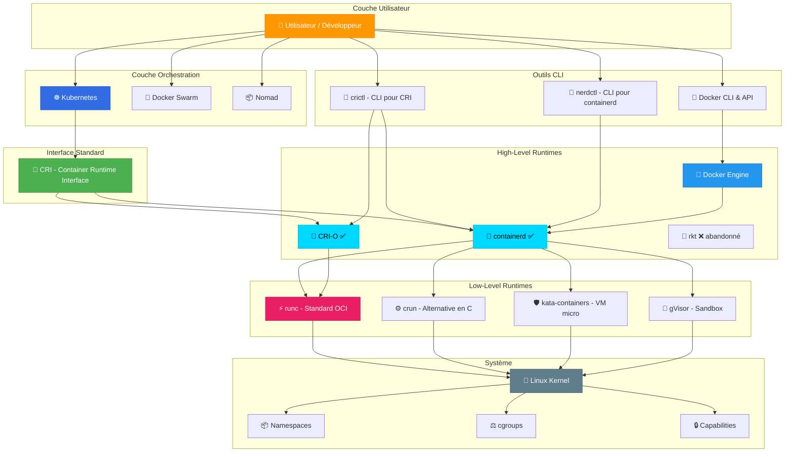
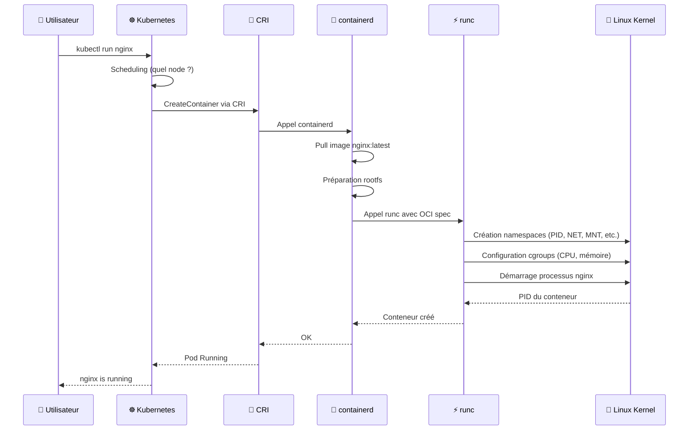

# 🏗️ Architecture Complète de l'Écosystème des Conteneurs

> Vue d'ensemble de toutes les couches, de l'utilisateur au kernel Linux

## 🎯 Architecture en couches

### Diagramme complet



## 📊 Tableau récapitulatif des couches

| Couche | Composants | Rôle | Exemples |
|--------|-----------|------|----------|
| **🎭 Orchestration** | Kubernetes, Swarm, Nomad | Déploiement, scaling, scheduling | `kubectl apply`, `docker stack deploy` |
| **🔌 Interface** | CRI | Standard de communication | API gRPC pour K8s |
| **🛠️ CLI Tools** | docker, crictl, nerdctl | Interface utilisateur | `docker run`, `crictl ps` |
| **🏢 High-Level Runtime** | containerd, CRI-O, Docker | Gestion images, snapshots, réseau | Pull d'images, création réseau |
| **⚡ Low-Level Runtime** | runc, crun, kata | Exécution réelle du conteneur | Création namespaces, cgroups |
| **🐧 Kernel** | Linux Kernel | Isolation et ressources | namespaces, cgroups, capabilities |

## 🔄 Flow complet : De la commande à l'exécution

### Exemple : `kubectl run nginx --image=nginx:latest`



## 🔍 Détail de chaque couche

### 1️⃣ Couche Utilisateur
```
┌──────────────────────────────────┐
│  Utilisateur / Développeur       │
│  • Écrit des manifests YAML      │
│  • Utilise CLI (kubectl, docker) │
│  • Définit les workloads         │
└──────────────────────────────────┘
```

### 2️⃣ Couche Orchestration
```
┌──────────────────────────────────┐
│  Kubernetes / Docker Swarm       │
│  • Scheduling de pods            │
│  • Load balancing                │
│  • Auto-scaling                  │
│  • Health checks                 │
│  • Décisions d'orchestration     │
└──────────────────────────────────┘
```

**Communication avec runtimes :**
- Kubernetes → Utilise **CRI** (standard)
- Docker Swarm → Utilise **Docker Engine** directement

### 3️⃣ Interface CRI (pour Kubernetes uniquement)
```
┌──────────────────────────────────┐
│  CRI (Container Runtime Interface│
│  • API gRPC standardisée         │
│  • RuntimeService (conteneurs)   │
│  • ImageService (images)         │
│  • Abstraction du runtime        │
└──────────────────────────────────┘
```

**Pourquoi CRI existe ?**
- Permettre à Kubernetes de supporter **n'importe quel runtime**
- Éviter le couplage fort avec Docker
- Faciliter l'innovation (nouveaux runtimes)

### 4️⃣ Outils CLI (Interface utilisateur)
```
┌──────────────────────────────────┐
│  Docker CLI, crictl, nerdctl     │
│  • Commandes human-friendly      │
│  • Abstraction de complexité     │
│  • Debugging et inspection       │
└──────────────────────────────────┘
```

**Exemples :**
```bash
# Docker CLI (parle à Docker Engine)
docker run -d nginx

# crictl (parle via CRI)
crictl run container.json pod.json

# nerdctl (parle à containerd directement)
nerdctl run -d nginx
```

### 5️⃣ High-Level Runtimes
```
┌──────────────────────────────────┐
│  containerd / CRI-O / Docker     │
│  • Gestion des images            │
│  • Registry (pull/push)          │
│  • Snapshots & overlayfs         │
│  • Réseau (CNI plugins)          │
│  • Volumes et montages           │
│  • Appel low-level runtime       │
└──────────────────────────────────┘
```

**Responsabilités :**
- **Télécharger** les images depuis un registry (Docker Hub, etc.)
- **Décompresser** et préparer le rootfs (système de fichiers)
- **Gérer** les réseaux avec CNI (Container Network Interface)
- **Appeler** le low-level runtime (runc) pour créer le conteneur

**Différences entre les runtimes :**

| Runtime | Utilisé par | Taille | Compatibilité CRI |
|---------|------------|--------|------------------|
| **containerd** | Docker, K8s | ~200 MB | ✅ Oui (plugin) |
| **CRI-O** | Kubernetes uniquement | ~50 MB | ✅ Oui (natif) |
| **Docker Engine** | Docker CLI | ~500 MB | ❌ Non (était dockershim) |

### 6️⃣ Low-Level Runtimes (OCI)
```
┌──────────────────────────────────┐
│  runc / crun / kata / gVisor     │
│  • Implémentation OCI spec       │
│  • Création namespaces           │
│  • Configuration cgroups         │
│  • Lancement du processus        │
│  • Pas de gestion d'images       │
└──────────────────────────────────┘
```

**Spécification OCI (Open Container Initiative) :**
- **runtime-spec** : Comment exécuter un conteneur
- **image-spec** : Format des images de conteneurs

**Implémentations :**

| Runtime | Langage | Particularité |
|---------|---------|---------------|
| **runc** | Go | Référence officielle, utilisé partout |
| **crun** | C | Plus rapide, consomme moins de mémoire |
| **kata-containers** | Rust/Go | Conteneurs dans des micro-VMs (sécurité++) |
| **gVisor** | Go | Sandbox userspace (Google) |

**Exemple de fichier OCI spec (config.json) :**
```json
{
  "ociVersion": "1.0.2",
  "process": {
    "terminal": false,
    "user": {"uid": 0, "gid": 0},
    "args": ["nginx", "-g", "daemon off;"],
    "env": ["PATH=/usr/local/sbin:/usr/local/bin:/usr/sbin:/usr/bin:/sbin:/bin"],
    "cwd": "/"
  },
  "root": {
    "path": "/var/lib/containerd/io.containerd.snapshotter.v1.overlayfs/snapshots/42/fs",
    "readonly": true
  },
  "mounts": [
    {"destination": "/proc", "type": "proc", "source": "proc"},
    {"destination": "/dev", "type": "tmpfs", "source": "tmpfs"}
  ],
  "linux": {
    "namespaces": [
      {"type": "pid"},
      {"type": "network"},
      {"type": "ipc"},
      {"type": "uts"},
      {"type": "mount"}
    ],
    "resources": {
      "memory": {"limit": 536870912},
      "cpu": {"shares": 1024}
    }
  }
}
```

### 7️⃣ Linux Kernel
```
┌──────────────────────────────────┐
│  Linux Kernel                    │
│  • Namespaces (isolation)        │
│  • cgroups (ressources)          │
│  • Capabilities (permissions)    │
│  • Seccomp (syscalls)            │
│  • AppArmor / SELinux            │
└──────────────────────────────────┘
```

**Technologies d'isolation :**

#### Namespaces (Isolation)
Isoler différentes ressources du système :

| Namespace | Isole quoi ? | Exemple |
|-----------|--------------|---------|
| **PID** | Processus | Conteneur voit uniquement ses processus |
| **NET** | Réseau | Interface réseau virtuelle |
| **MNT** | Système de fichiers | `/` différent pour chaque conteneur |
| **UTS** | Hostname | Hostname indépendant |
| **IPC** | Inter-Process Communication | Files de messages séparées |
| **USER** | UID/GID | Root dans conteneur ≠ root sur l'hôte |
| **CGROUP** | Vue des cgroups | Isolation des limites de ressources |

#### cgroups (Limitation ressources)
Limiter et mesurer l'utilisation des ressources :

```bash
# Limiter la mémoire
docker run -m 512m nginx

# Limiter le CPU
docker run --cpus="1.5" nginx

# Vérifier les cgroups
cat /sys/fs/cgroup/memory/docker/<container_id>/memory.limit_in_bytes
```

| cgroup | Contrôle |
|--------|----------|
| **cpu** | % de CPU, partage de temps |
| **memory** | Limite RAM, swap |
| **blkio** | I/O disque |
| **net_cls** | Trafic réseau |
| **devices** | Accès périphériques |

#### Capabilities (Privilèges)
Au lieu de root/non-root, granularité fine :

```bash
# Donner uniquement la capability de bind sur port < 1024
docker run --cap-add=NET_BIND_SERVICE nginx

# Retirer toutes les capabilities sauf une
docker run --cap-drop=ALL --cap-add=NET_BIND_SERVICE nginx
```

## 🔀 Cas d'usage : Docker vs Kubernetes

### Avec Docker (sans Kubernetes)
```
docker run nginx
    ↓
Docker CLI
    ↓
Docker Engine (API)
    ↓
containerd
    ↓
runc
    ↓
Linux Kernel
```

### Avec Kubernetes
```
kubectl run nginx
    ↓
Kubernetes API Server
    ↓
kubelet (sur le node)
    ↓
CRI (gRPC)
    ↓
containerd (ou CRI-O)
    ↓
runc
    ↓
Linux Kernel
```

## 🧪 Commandes pour explorer

### Voir le runtime utilisé par Docker
```bash
docker info | grep -i runtime
# Runtimes: io.containerd.runc.v2
```

### Inspecter containerd directement
```bash
# Lister les conteneurs via containerd
sudo ctr containers list

# Lister les namespaces containerd
sudo ctr namespaces list
```

### Inspecter runc
```bash
# Lister les conteneurs runc en cours
sudo runc list

# Voir l'état d'un conteneur
sudo runc state <container-id>
```

### Voir les namespaces Linux d'un conteneur
```bash
# Trouver le PID du processus principal
docker inspect <container> | grep Pid

# Voir les namespaces associés
sudo ls -la /proc/<PID>/ns/
```

### Voir les cgroups d'un conteneur
```bash
# Trouver le container ID
docker ps

# Voir les cgroups
sudo ls /sys/fs/cgroup/memory/docker/<container_id>/
sudo cat /sys/fs/cgroup/memory/docker/<container_id>/memory.limit_in_bytes
```

## 📚 Ressources

- [OCI Specification](https://github.com/opencontainers/runtime-spec)
- [Linux Namespaces](https://man7.org/linux/man-pages/man7/namespaces.7.html)
- [cgroups Documentation](https://www.kernel.org/doc/Documentation/cgroup-v2.txt)
- [containerd Architecture](https://github.com/containerd/containerd/blob/main/docs/architecture.md)

---

← [[06-Docker-et-Runtimes|Docker et les Runtimes]] | [[08-rkt-Histoire|Histoire de rkt]] →
