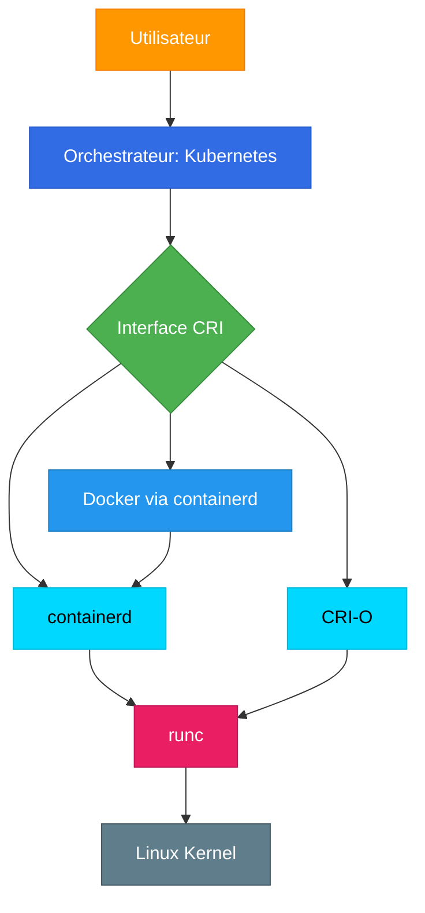

# ⚙️ Container Runtimes - L'écosystème complet

> Comprendre l'architecture sous-jacente de la conteneurisation

## 📑 Contenu

### [[01-Introduction-Runtimes|📖 Introduction aux Container Runtimes]]
- Qu'est-ce qu'un runtime de conteneur ?
- Pourquoi plusieurs runtimes ?
- High-level vs Low-level runtimes

### [[02-Containerd|🔷 containerd]]
- Présentation de containerd
- Architecture et composants
- Relation avec Docker
- Utilisation avec Kubernetes

### [[03-CRI-O|🔶 CRI-O]]
- Qu'est-ce que CRI-O ?
- Design minimaliste pour Kubernetes
- Comparaison avec containerd

### [[04-runc|⚡ runc - Le runtime OCI]]
- Spécification OCI (Open Container Initiative)
- runc : l'implémentation de référence
- Alternatives (crun, kata-containers, gVisor)

### [[05-CRI-Interface|🔌 CRI - Container Runtime Interface]]
- Définition du standard CRI
- Pourquoi Kubernetes a créé CRI
- Comment CRI fonctionne
- Plugins CRI

### [[06-Docker-et-Runtimes|🐳 Docker et les Runtimes]]
- Docker utilise containerd
- Déprécation de dockershim
- Migration de Docker vers containerd

### [[07-Architecture-Complete|🏗️ Architecture Complète]]
- Vue d'ensemble de toutes les couches
- Flow complet d'un conteneur
- Schémas et diagrammes

### [[08-rkt-Histoire|📜 rkt (abandonné)]]
- Histoire de rkt (CoreOS)
- Pourquoi abandonné
- Leçons apprises

## 🎯 Objectifs d'apprentissage

À la fin de ce module, vous comprendrez :

✅ La différence entre high-level et low-level runtimes
✅ Comment containerd et CRI-O s'intègrent avec Kubernetes
✅ Le rôle de runc et de la spécification OCI
✅ Ce qu'est l'interface CRI et pourquoi elle existe
✅ L'architecture complète de l'écosystème des conteneurs

## 🗺️ Schéma général

## 📚 Ressources

- [containerd.io](https://containerd.io/)
- [CRI-O](https://cri-o.io/)
- [OCI Runtime Specification](https://github.com/opencontainers/runtime-spec)
- [Kubernetes CRI](https://kubernetes.io/docs/concepts/architecture/cri/)

---

**Commencer → [[01-Introduction-Runtimes|Introduction aux Container Runtimes]]**
